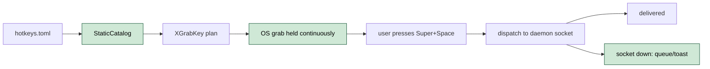
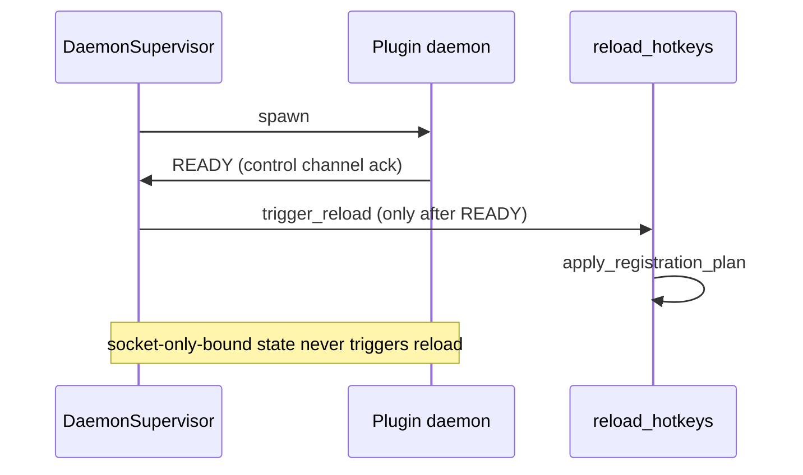

# TRAY-12 Hotkey Grab Persistence

- **Status:** Accepted
- **Closes:** #12
- **Date:** 2026-05-03
- **Related:** TRAY-10, TRAY-22 (doctor sentinel)

## Problem

qol-tray silently releases its OS-level hotkey grabs (`XGrabKey` on X11) on two distinct paths, with no user-visible signal. The most credible explanation for the recent "`Super+Space` stopped working — Cinnamon stole it" report is that this is **not** the desktop environment claiming the key — it is qol-tray quietly handing the grab back during a window where the launcher's socket was briefly down (e.g. during a daemon restart).

```mermaid
stateDiagram-v2
    direction LR
    [*] --> ListenerSpawned: hotkeys::listener::spawn
    ListenerSpawned --> GrabHeld: HotkeyManager::new ok, XGrabKey ok
    GrabHeld --> ListenerDead: HotkeyManager::new fails (X11 flap on resume)
    GrabHeld --> ReloadTick: daemon_supervisor state-change
    ReloadTick --> GrabReissued: socket reachable, plan applied
    ReloadTick --> GrabReleased: socket unreachable at probe moment
    ListenerDead --> [*]: thread returns, no watchdog
    GrabReleased --> DesktopStealsKey: DE binding now wins
    classDef bad fill:#f5c2c7,stroke:#842029,color:#000
    classDef warn fill:#ffeeba,stroke:#856404,color:#000
    class ListenerDead bad
    class GrabReleased bad
    class DesktopStealsKey bad
    class ReloadTick warn
```

| ID | State | Smell |
|----|-------|-------|
| TRAY-12.1 | 🔴 Broken | Hotkey listener thread dies silently when `HotkeyManager::new()` fails (X11 flap on resume). No watchdog, no retry, no signal — `Super+Space` stops working forever until manual restart. |
| TRAY-12.2 | 🔴 Broken | `reload_hotkeys()` re-issues `XGrabKey` only for plugins whose socket is reachable at the probe moment. A momentary `UnixStream::connect()` failure during a daemon restart causes the OS grab to be released to the desktop environment. |
| TRAY-12.3 | 🟡 Leaky | Reload uses live socket probes as a proxy for "plugin can serve the action", but a reachable socket is not the same as a healthy daemon, and an unreachable socket during restart is not the same as a removed plugin. |

> Severity: 🔴 bad (broken / silent failure / data loss) · 🟡 warn (leaky / race / brittle) · 🟢 good (used in proposal diagrams to mark what is now safe)

### Affected files

- `src/hotkeys/listener.rs:20` — thread spawn (`HotkeyListenerRuntime::run`)
- `src/hotkeys/listener.rs:41` — silent thread death on `HotkeyManager::new()` failure
- `src/hotkeys/listener.rs:67-71` — `HotkeyListenerLoop::reload_hotkeys()`
- `src/hotkeys/catalog.rs:11-15` — `load_available_actions()`
- `src/hotkeys/catalog.rs:72-74` — `default_socket_reachable()` live probe
- `src/hotkeys/manager.rs:56` — `apply_registration_plan()` excludes unreachable plugins
- `src/plugins/daemon_supervisor.rs:79` — `crate::hotkeys::trigger_reload()` invocation

## Proposals

### Proposal A — Watchdog the listener thread `[cheap]`

Wrap `HotkeyListenerRuntime::run()` in a supervisor loop. If `HotkeyManager::new()` fails, retry with exponential backoff (capped, e.g. 1s → 2s → 5s → 30s). If the run loop returns unexpectedly, log loudly and restart. Surface persistent failure (>N consecutive) to the tray with a visible badge so the user knows hotkeys are down.

```mermaid
stateDiagram-v2
    direction LR
    [*] --> Supervisor
    Supervisor --> RuntimeOk: HotkeyManager::new ok
    Supervisor --> Backoff: HotkeyManager::new fails
    Backoff --> Supervisor: retry after delay
    RuntimeOk --> Supervisor: run loop returns
    RuntimeOk --> [*]: shutdown signal
    Supervisor --> TrayBadge: N consecutive failures
    classDef good fill:#cfe8d6,stroke:#0f5132,color:#000
    class Supervisor,RuntimeOk,Backoff,TrayBadge good
```

| Pros | Cons |
|------|------|
| Closes the silent-thread-death failure mode entirely. | Doesn't fix Path 2 — must be paired with Proposal B or C. |
| Small, localized change (one file). | Requires defining "persistent failure" threshold and tray-badge surface. |
| Same supervisor pattern is reusable for any background thread we add later. | Backoff timing is a tuning knob someone has to maintain. |

**Closes:** TRAY-12.1

---

### Proposal B — Decouple OS grab from socket probe `[medium]`

Stop using socket reachability as the gate for `XGrabKey`. Keep the OS grab live for every action declared in the static catalog (config-driven), regardless of whether the daemon's socket happens to be reachable at probe time. On dispatch, attempt to send the action to the daemon; if the socket is down, fall back gracefully (queue, retry-once, or show a transient toast). Reload only adjusts the OS grab when the *catalog* changes, not when daemons flap.



| Pros | Cons |
|------|------|
| OS grab is no longer hostage to daemon liveness — fixes the user-visible Cinnamon-stole-the-key symptom. | Larger refactor — splits "what keys do we own" from "what daemons can we talk to". |
| Matches how grabbed keys are conceptually owned by the *app*, not by individual daemons. | Need a dispatch fallback policy (queue vs drop vs toast); each has UX implications. |
| Removes a class of races between supervisor ticks and reload ticks. | Unmounting a plugin still needs an explicit "release this key" path — can't rely on probe-driven removal. |

**Closes:** TRAY-12.2, TRAY-12.3

---

### Proposal C — Gate reload on confirmed daemon-serving `[medium]`

Keep the current "reload re-applies the full plan" architecture, but change the reachability signal. Instead of `UnixStream::connect()` (which only proves something is bound to the socket path), require the daemon to send a one-shot `READY` ack on its control channel after each restart. `reload_hotkeys()` only fires once every supervised daemon has either acked READY or been declared dead-and-removed. Brief restart windows no longer trigger reload at all.



| Pros | Cons |
|------|------|
| Smaller surface than B — keeps catalog/grab coupling intact. | Requires a daemon-side protocol change (READY ack) — every plugin daemon must implement it. |
| Reload becomes deterministic w.r.t. daemon state instead of probabilistic w.r.t. probe timing. | Still leaves the OS grab transiently released during the window before the *first* reload after a daemon dies for good. |
| Matches the supervisor's mental model (daemons have lifecycle states, not just PID-alive). | Doesn't help if the daemon is alive but slow to ack — same race window, just narrower. |

**Closes:** TRAY-12.2

---

**Recommended:** A + B together. A is cheap and closes the listener-death class on its own; B is the structurally correct fix for the grab-release class and matches the user's mental model that "qol-tray owns Super+Space, period". C is a viable alternative to B if the team prefers minimum daemon-protocol churn, but it doesn't address TRAY-12.3 (probe semantics conflate "socket bound" with "daemon healthy").

## Decision

A + B both shipped. The "tray-badge surface" sketched in Proposal A is implemented through the doctor-sentinel mechanism added in TRAY-22 rather than a bespoke badge: when the listener supervisor's backoff saturates at `MAX_BACKOFF` (≈62s of escalating retries) and the runner still fails, it writes the `needs-doctor.json` sentinel with `check_id = hotkey_shadows`. Doctor consumes the sentinel on next boot and surfaces the failure through its normal report path. Transient X11 flaps on resume self-heal during the backoff ramp and never reach the sentinel.

`HotkeyManager::register_planned_hotkey` writes the same sentinel on per-key grab failures (already wired in TRAY-22) so DE-shadow conflicts that survive auto-unshadow also escalate to doctor.

## Notes

- Diagnosis came from four root-cause comments on #10:
  - https://github.com/qol-tools/qol-tray/issues/10#issuecomment-4366903450
  - https://github.com/qol-tools/qol-tray/issues/10#issuecomment-4366938482
  - https://github.com/qol-tools/qol-tray/issues/10#issuecomment-4366959645
  - https://github.com/qol-tools/qol-tray/issues/10#issuecomment-4366994835
- #10 covers the supervisor lifecycle bug class; this ADR is scoped strictly to hotkey grab persistence. Implementation work for the two should not be bundled.
