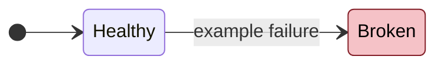
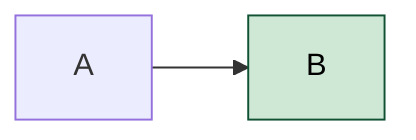
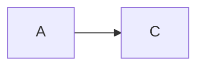

# TRAY-28 Sync Pull on Launch Conflict Tests

- **Status:** Proposed
- **Closes:** #28
- **Date:** 2026-05-09
- **Related:** {OTHER-PID}, {OTHER-PID-2}

## Problem

{1-2 sentence framing of the current state and why it hurts.}

| ID | State | Smell |
|----|-------|-------|
| TRAY-28.1 | 🔴 Broken | one-sentence smell |
| TRAY-28.2 | 🟡 Leaky | one-sentence smell |

> Severity: 🔴 bad (broken / silent failure / data loss) · 🟡 warn (leaky / race / brittle) · 🟢 good (used in proposal diagrams to mark what is now safe)

## Proposals

### Proposal A — {name} `[cheap|medium|heavy]`

{Short description of the change.}

| Pros | Cons |
|------|------|
| one sentence | one sentence |
| one sentence | one sentence |

**Closes:** TRAY-28.1, TRAY-28.2

---

### Proposal B — {name} `[cheap|medium|heavy]`

{Short description.}

| Pros | Cons |
|------|------|
| one sentence | one sentence |

**Closes:** TRAY-28.2

---

**Recommended:** A (or A+B together).

## Notes

Free-form notes, links to related ADRs, references to industry patterns, or context the diagram cannot carry. Optional.
