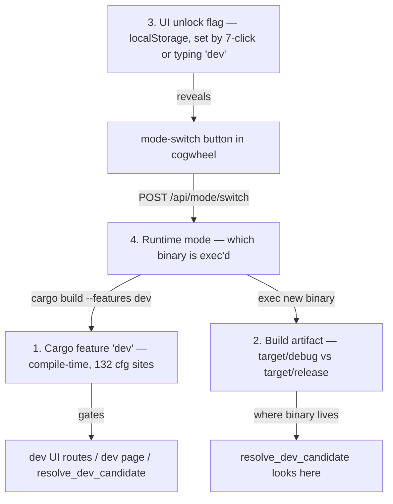
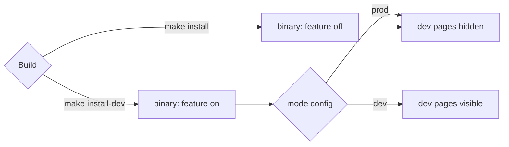
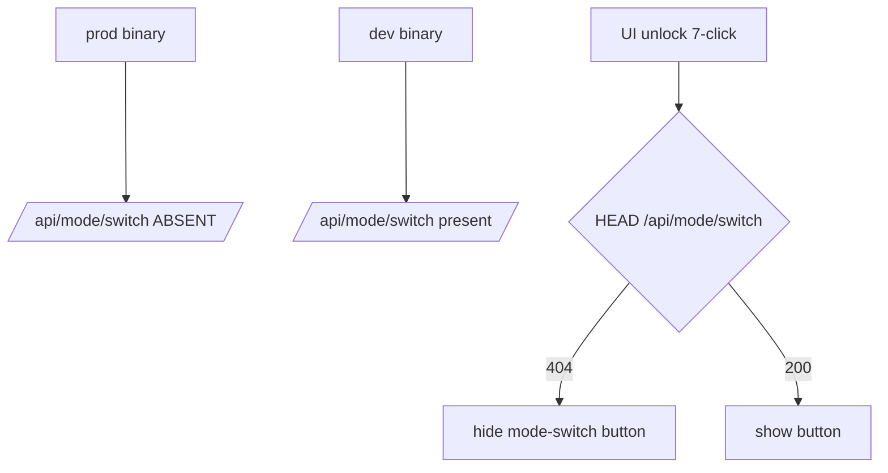

# TRAY-6 5. Dev/prod — the four overlapping notions

- **Status:** Accepted
- **Issue:** #6
- **Date:** 2026-05-03

## Problem

| ID | State | Smell |
|----|-------|-------|
| TRAY-6.1 | 1 | compile-time feature |
| TRAY-6.2 | 2 | build profile |
| TRAY-6.3 | 3 | UI unlock |
| TRAY-6.4 | 4 | runtime mode |

## Proposals

### Proposal A — Collapse to two axes: capability + runtime mode `[medium]`

Drop the cycle. Two axes, orthogonal:

The localStorage unlock and the mode-switch endpoint go away. Mode is a config file. make install-dev sets it; tray menu can flip it. No cycle.

| Pros | Cons |
|------|------|
| two orthogonal axes. No cycle. No localStorage gating a rebuild. End-user prod binary literally cannot show dev pages (capability not compiled). | removes the "magic 7-click recompile to dev" flow. Devs must run make install-dev manually. Loses a cute trick. |

Implementation notes:

- Capability is compile-time. A prod-feature binary returns `false` from `/api/dev/enabled` regardless of `mode.json`.
- Runtime mode is file-backed. Missing `mode.json` means prod.
- `/api/dev/enabled` remains the unguarded capability probe. In a dev-feature binary, every other `/api/dev/*` route returns 404 while runtime mode is prod.
- The tray menu toggle writes `mode.json`, but the tray label/check state refreshes only after restart.
- An already-open UI sees mode changes after refresh/reopen, not live.
- `make dev` runs `cargo run --features dev` directly and does **not** write `mode.json`. A first-time developer therefore boots with dev pages hidden until they either run `make install-dev` once (writes `mode = dev`) or flip the tray-menu toggle. Subsequent `make dev` cycles inherit whatever value is already in `mode.json`.

**Closes:** TRAY-6.1, TRAY-6.3, TRAY-6.4

---

### Proposal B — Keep the cycle, fence the gates `[cheap]`

Keep all 4 notions but make each one's gate explicit and matched. switch_to_dev becomes cfg(feature = "dev")-only (so prod binaries don't even register the route). UI unlock check first probes whether the endpoint exists; if not, hides the button.

Recommended: A. Collapses 4→2, kills the cycle, costs one config file.

| Pros | Cons |
|------|------|
| tiny diff. Fixes the immediate "prod button does nothing" smell. | cycle remains. Future maintainer still has to reason about 4 notions. Doesn't solve the architectural confusion you started this session for. |

**Closes:** TRAY-6.4
