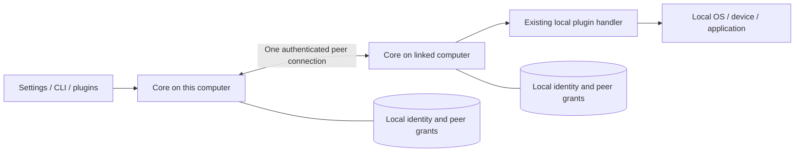
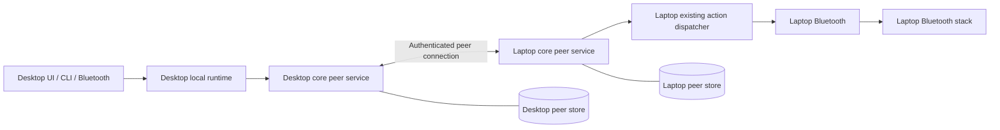

# Linked computers: architecture and sources of truth

Status: Core peer service, CLI, native/web linked-computer settings, the PointZ cutover and earbud handoff are implemented in the linked-computers worktree and exercised in isolated tests. Guest, multi-PC and hardware verification remain unfinished. This is a branch checkpoint; nothing from this implementation is installed or released.

[Open the interactive architecture page](../../apps/tray/diagram/linked-computers.html)
for the connection model, searchable ownership map, and illustrative Bluetooth
handoff. The viewer embeds these ownership tables and derives package relationships
from Cargo metadata; it introduces no separately maintained owner list.

Rebuild with `node apps/tray/diagram/linked-computers/build.mjs`; use `--check` to
verify the generated page or `--serve` to rebuild and open a local preview server.
The generated HTML works offline when opened directly. Its source links resolve
inside this checkout. The walkthrough does not communicate with real devices.

## Implementation status

This table describes the current worktree. The Bluetooth walkthrough remains an
illustration of the intended result. It is not a working handoff control.

| Capability | Before this work | Current worktree | Verification and remaining work |
| --- | --- | --- | --- |
| Link two computers | No reusable core computer-linking service | Core identity, explicit pairing, encrypted sessions and headless controls exist; links persist on Linux and macOS | Pairing and restart recovery pass in isolated generated-TLS fixtures on both systems; real-PC and guest verification remain |
| Permit a remote plugin action | No common authenticated peer request path | Core checks the canonical operation and exact grant, dispatches once, and saves the result | Real local clients, TLS, catalog, executor and fixture daemon pass together; duplicate and lost-reply cases pass |
| Recover after a lost reply | No shared remote request history | CLI/API can query or cancel the original request without invoking a replacement | Sender restart, daemon reply loss and recovery pass in tests; a handler acknowledgement is not device success |
| Use earbuds from the desktop | Phone and laptop occupy both slots | "Move here" asks the linked computer that has the earbuds to let go, connects them here and checks audio. Bluetooth and Controllers share reconnect holds, so neither undoes the other | The workflow, holds and hold-aware reconnect pass tests with fake computers and a temporary hold store; real earbuds between two computers remain |
| Share PointZ trust with core | PointZ owns its own pairing and key registry | Core owns the PointZ seed, paired phones, pairing window and UDP ports; PointZ only executes input | One-time import, legacy-daemon exclusion, removal and a simulated phone pairing over UDP pass in tests; the Flutter client on a real phone remains |
| Manage linked computers in settings | No linked-computers settings screen | Native and web controls use the same core authority for pairing, revocation, names and explicit operation grants | Catalog, permission and uncertain-result recovery checks pass; guest interaction verification remains |
| Deliver the complete feature | No feature delivery | Branch checkpoint with the core service, PointZ cutover, CLI, settings, earbud handoff and architecture viewer | Strict lint and the peer, host, PointZ and Bluetooth suites pass; guest, multi-PC and hardware verification remain |

## High-level design

Make communication between linked computers a core QoL capability. Bluetooth
handoff is its first desktop workflow. PointZ must use the same peer authority
when the new service ships.

The governing invariant is **one owner and one write path for each fact**.
Sharing a Rust library is insufficient if every plugin instantiates a registry,
opens its own pairing session, or decides independently whether a peer is trusted.

Every computer runs the same core service. The user links computers once in core
settings. A plugin requests an operation on a linked computer through core; the
receiving core checks permission and invokes its existing local plugin handler.
Results and live updates return through that connection.

For the earbuds, desktop Bluetooth asks laptop Bluetooth to release its local
connection. The desktop then connects and verifies audio readiness. Core handles
which computer, who may ask, and delivery; Bluetooth handles the peripheral and
the outcome.

The first delivery targets computers reachable on the local network, with
discovery and pairing handled by QoL. Local actions keep working independently
of network discovery. Adding another transport later must use the same identities,
permissions, and operation contracts.

## Mission constraints

The peer layer follows the existing Portable/Resident ownership contract:

- Cross-platform adapters implement one headless API. Unsupported operations
  report their limitation explicitly.
- QoL performs discovery, pairing, and any required host integration; the user
  does not edit OS services, firewall rules, or configuration files.
- Infrastructure changes have an explicit lifetime. Portable changes restore
  after normal exit and crashes; Resident changes require local opt-in and
  remain reversible. Reuse the existing host ownership journals.
- A peer request cannot make a computer Resident. Profile synchronization cannot
  grant peer trust. User-directed changes, such as selecting an audio output,
  retain the existing user-action semantics.
- Dependencies ship with QoL. Discovery does not delay startup, and connection,
  permission, and handoff failures have visible outcomes.

Temporary use must not leave peer credentials behind on a borrowed host.
Persistent links on personal computers and session-only links use the same core
authority with an explicit storage lifetime; private keys never travel in a
synced profile.

## Existing owners

The source audit found these boundaries:

| Concern | Current owner |
| --- | --- |
| Local host/plugin requests, replies, and subscriptions | [qol-runtime](../../libs/runtime/src/protocol.rs) and the [tray runtime handler](../../apps/tray/src/runtime/server/socket/platform/unix/requests.rs) |
| Reusable local process-credential and event-broker primitives | [Runtime broker](../../libs/runtime/src/broker/mod.rs); production host integration was not established by this source audit |
| Plugin identity, activation actions, and runtime invocation | [PluginManifest](../../libs/plugin-api/src/manifest/schema.rs), populated from `plugin.toml` |
| Parameterized action APIs, queries, and streams | [RuntimeSpec](../../libs/config/src/contract/runtime.rs), populated from `qol-runtime.toml` where present |
| Plugin execution | [Host action executor](../../apps/tray/src/plugins/action_executor/mod.rs) |
| An existing adapter exposing declared actions | [MCP tool host](../../apps/tray/src/features/mcp/tool_host.rs) |
| PointZ pairing, peer keys, identity, and discovery | [Security](../../plugins/pointz/src/security/mod.rs), [registry](../../plugins/pointz/src/security/registry.rs), [identity](../../plugins/pointz/src/security/secret.rs), and [discovery](../../plugins/pointz/src/discovery/mod.rs) |
| Profile synchronization | [qol-profile-sync](../../libs/profile-sync/src/lib.rs) |
| Host residency identity | [qol-host-fixes residency](../../libs/host-fixes/src/residency.rs) |
| Bluetooth device operations and observations | [Bluetooth runtime contract](../../plugins/bluetooth/qol-runtime.toml) and its platform implementations |

The baseline audit found no shared computer-linking service. The worktree now
contains the core peer service, host integration, CLI and native/web settings.
PointZ trust moved into core as described in the
[PointZ migration contract](2026-09-28-peer-pointz-migration-v1.md); the plugin
keeps command decoding and input execution.

The tray socket handles `RuntimeRequest`. The broker library's existence does
not establish that the running host authenticates processes or routes events
through that broker. Any design relying on its enforcement must first establish
the integration and verify the security boundary.

## Core boundary

The headless peer capability is implemented in `libs/peers` (`qol-peers`). Its domain
model, identity, pairing, trust store, authenticated sessions, and request
lifecycle have one implementation. It does not depend on Bluetooth, PointZ,
GPUI, or the tray application.

The host integration at `apps/tray/src/features/linked_computers` supervises one
instance per user and runtime namespace. It supplies the existing plugin
dispatcher, contract catalog, paths, and presentation adapters. It owns startup
and shutdown; the library owns peer behavior.

The service holds the exclusive writer lock for its state. CLI commands, settings,
and plugins use client APIs through the existing local runtime boundary. They
cannot open or independently mutate the peer store. Standalone use must reach
the same headless service, including singleton enforcement; a plugin must not
start an embedded alternative authority.

Inter-computer transport terminates at core on each machine. Local plugin
communication continues through the existing request, subscription, and action
paths. Local process credentials must never be treated as network peer
credentials.

## Sources of truth

| Fact | Sole authority | Consumer behavior |
| --- | --- | --- |
| This host's QoL peer identity | Core peer identity store, scoped to the host and user | Plugins and transports receive an identity handle; names and IP addresses are attributes |
| Which remote peers may act here, and their grants | This host's core peer registry | Every inbound request is checked by this service; pairing, revocation, and permission changes use its write path |
| Whether a peer is reachable | Core's authenticated session state | UI and plugins receive snapshots and events; last-seen records do not imply an active connection |
| What an installed plugin can do | Its existing manifest/runtime contract and platform implementation | Core derives available peer operations from these definitions and current local availability |
| Whether an earbud link and audio transport exist | The local Bluetooth stack, interpreted by the Bluetooth plugin | Remote values carry origin and freshness; core forwards observations |
| Whether QoL may reconnect a peripheral automatically | [qol-bluetooth-control](../../libs/bluetooth-control/src/holds.rs) reconnect holds | Automatic reconnect skips a held address; a connect the user starts releases the hold |
| Whether a handoff succeeded | Bluetooth's verified operation outcome | A transport acknowledgement alone never marks a handoff complete |

Each computer is authoritative for its own permissions and local device state.
Another computer holds a projection of that information. Snapshots need an
origin, session generation, and revision so reconnects cannot revive stale
online state. Mutations go to the owner and return its updated result.

Peer identity and grants are host-scoped and excluded from profile sync/export.
Copying a profile to another computer must not copy its network identity or
authorization. Residency's existing machine identity continues to identify host
policy; it is not proof of network trust. Any required association is maintained
by core, without a second plugin-maintained device inventory.

## One operation contract

Activation actions and their argv are authored in `plugin.toml`; parameterized
action APIs, queries, and streams are authored in `qol-runtime.toml` where present.
Some plugins only have the former. The shared catalog resolves these declarations
and validates references by stable plugin UID and operation identity. Matching
activation/API entries must resolve to the same behavior.

Peer exposure belongs to the operation's canonical declaration and shared
validator. Do not add a parallel `peer-actions` file, a hand-maintained remote
action list, or separate network versions of local handlers. An additional typed
API needed by a consumer extends the existing plugin contract for every caller.

The host derives its callable catalog once from installed validated contracts.
Settings, MCP, and the peer adapter consume that catalog with their respective
exposure rules. Existing `agent_tool` metadata grants no peer access. Per-peer
permissions in the core registry reference canonical operation identities; they
do not redefine their schemas or execution logic.

Core's peer-management operations likewise have one headless definition consumed
by its CLI, settings, and diagnostics. UI controls never become an additional
policy or persistence owner.

Core owns request correlation, deadlines, authorization, and delivery status.
Retries must follow the operation's declared idempotency contract. A lost reply
leaves the outcome unknown until reconciled; it does not authorize replaying an
arbitrary action. Bluetooth owns resource preconditions and device-specific
results. These are distinct facts with explicit owners.

## PointZ migration is part of the foundation

The new service must not ship alongside an independently writable PointZ trust
registry. The first usable core release includes this migration:

1. Extract neutral identity, pairing, trust, and authenticated peer handling from
   PointZ behind the core capability boundary. Preserve PointZ command decoding,
   gestures, and input execution in PointZ.
2. Verify the installed PointZ version supports core ownership and stop its
   legacy writer before taking the migration snapshot. Import its identity and
   paired-device records once, under the core service's writer lock. Preserve
   only their existing PointZ permissions; migration cannot grant Bluetooth or
   other plugin access.
3. Commit imported state and the migration marker durably before retiring the
   old writer. An interrupted migration must resume without dropping pairings.
4. Make PointZ pairing UI, discovery, and authentication delegate to core. Any
   legacy wire compatibility adapter uses the same registry and revocation path.
5. Remove PointZ's independent writer and registry implementation. A leftover
   legacy file must never reimport a subsequently revoked peer.

Core/plugin updates can arrive separately. The host must gate activation on a
compatible PointZ version and prevent its supervised legacy writer from restarting
after cutover. Installing the core update alone must not create dual authorities.

Wire compatibility and mobile-client changes must be checked together. Where
identity compatibility cannot be preserved, report the need to pair again;
do not silently create a second identity or widen existing permissions.

## Bluetooth handoff

Bluetooth coordinates the domain workflow through core:

1. Query linked peers through core and obtain fresh Bluetooth observations from
   peers authorized to share them. Identify the same peripheral through the
   Bluetooth domain contract, not by its display name.
2. Ask the selected laptop's Bluetooth plugin to release its local connection.
   That plugin verifies the peripheral is connected and prevents its own
   automatic reconnect from immediately reclaiming the slot.
3. The desktop connects using its existing Bluetooth operation and verifies
   actual link/audio readiness before reporting success.
4. Reconcile a failed or interrupted handoff and show the verified outcome.

The handoff workflow and its outcome belong to Bluetooth. Reconnect holds live
in a shared store so every plugin process honors them: each hold has an owner,
an expiry and a file that survives a daemon restart. A connect or reconnect the
user starts, from the daemon or the command line, releases the hold. Core
delivers requests without learning about audio profiles, multipoint limits, or
vendor-specific commands.

The Controllers plugin also disconnects Bluetooth devices.
[qol-bluetooth-control](../../libs/bluetooth-control/src/lib.rs) is the neutral
owner both plugins use for peripheral identity and reconnect holds; Controllers
holds a stuck controller for 30 seconds before it disconnects it. Connection
operations stay in each plugin's platform adapter, because the shared identity
and holds are what keep one writer from undoing another. Controllers retains its
HID/input and driver-fix policy; Bluetooth retains its reconnection and handoff
policy. QoL coordinates its own writers there while continuing to observe
changes made by the OS and other applications. The
[handoff contract](2026-09-28-bluetooth-handoff-v1.md) owns the operations,
the workflow and its evidence.

Remote observations do not establish global ownership of the earbuds: an
unmanaged phone may also be connected. Device identifiers that cannot be matched
across platform adapters must produce an explicit unsupported/unknown result.

## Delivery and verification

Land the shared capability with its host integration and migrated PointZ
consumer. Then implement Bluetooth handoff through that API. Do not land an
unused peer library or a Bluetooth-specific computer directory.

The implementation gate must demonstrate:

- Pairing through any supported surface produces the same core record;
  revocation immediately rejects new requests through every adapter.
- Core and plugin restarts preserve identity and grants. A competing service
  instance cannot become a second writer.
- Profile import and synchronization do not clone peer credentials or trust.
- Plugin contract changes update the peer catalog through the existing parser
  and dispatcher; disabled, absent, or unexposed operations are unavailable.
- Old session events cannot mark a disconnected peer online. A timed-out action
  is reconciled without an unintended second execution.
- Interrupted PointZ migration is recoverable, preserves existing scope, and
  cannot resurrect revoked peers from legacy files.
- A handoff handles concurrent requests, lost replies, plugin restart, laptop
  reconnection, and desktop connection failure without claiming false success.

Use the repository's affected-check workflow for build, format, lint, and tests.
Desktop integration verification runs in isolated guests. Add one reproducible
workflow node that accepts guest identities and fixtures, exercises pairing and
handoff, and emits `report.json` with observed state and request traces. Hardware
verification remains necessary before claiming a specific earbud model works.

The [peer transport contract](2026-09-27-peer-transport-v1.md) selects discovery,
identity, and cryptographic sessions for implementation. The existing PointZ
wire protocol remains a scoped compatibility concern; it does not establish
general inter-computer trust.

## Monorepo ownership map

This is a source index for the design. Membership comes from Cargo metadata and
plugin manifests; this document is not a second runtime registry. The audit
covers all 18 workspace plugins, 40 shared crates, the tray application, both
workspace tools, and the associated browser/build surfaces in this worktree.
Proposed owners are explicitly marked. Existing gaps follow the tables.

### Core facts and their authoritative owners

| Fact | Authoritative source / write boundary | What derives from it |
| --- | --- | --- |
| Workspace membership and dependencies | [Cargo.toml](../../Cargo.toml), member manifests, Cargo metadata, and [Cargo.lock](../../Cargo.lock) | Build/test plans; this ownership index |
| Plugin identity and declared support | Each `plugin.toml`, parsed by [qol-plugin-api](../../libs/plugin-api/src/manifest/schema.rs); durable references use its UID | Host identity indexes, labels, plugin discovery |
| Activation and invocation | `plugin.toml` action declarations and manifest resolver | Dashboard, hotkeys, launcher activation |
| Parameterized API operations | Existing manifests/runtime declarations, the [shared contract parser](../../libs/config/src/contract/runtime.rs), and [canonical operation catalog](../../libs/plugin-api/src/operations/mod.rs) | Settings queries, MCP tools and peer operation selection; installed availability is derived by the host catalog owner |
| Settings schema and defaults | Each `qol-config.toml` plus [qol-config contracts](../../libs/config/src/contract/mod.rs) | Native and browser forms, validation, normalized views |
| Settings values and scope | [ProfileScopeStore](../../apps/tray/src/features/profile/scope_store.rs) and [PluginConfigManager](../../apps/tray/src/plugins/config/mod.rs), using manifest field scopes | Resolved plugin config, environment delivery, [runtime config cache](../../apps/tray/src/plugins/config/runtime_cache.rs) |
| Profile selection, desired plugin lock, and synchronization | [Core profile feature](../../apps/tray/src/features/profile/mod.rs) and [qol-profile-sync](../../libs/profile-sync/src/lib.rs) | Sync transport, backups, import/export; peer access does not create another sync engine |
| Installed plugins and live daemon state | [Plugin registry](../../apps/tray/src/plugins/registry/mod.rs), [manager](../../apps/tray/src/plugins/manager/mod.rs), and [daemon tracker](../../apps/tray/src/plugins/daemon_tracker/mod.rs) for their distinct persisted/live facts | Status views and locally available operations; a profile's desired lock is not proof of a running daemon |
| User hotkey bindings | [Core hotkey store](../../apps/tray/src/hotkeys/store.rs); [manager](../../apps/tray/src/hotkeys/manager.rs) owns their live registration | Plugin activation and UI; shared chord grammar comes from `qol-hotkeys` |
| OS availability and permissions | [qol-platform](../../libs/platform/src/lib.rs) and the owning domain's platform adapter | Supported operations and meaningful unsupported results |
| Host ownership mode and restoration | [Residency](../../libs/host-fixes/src/residency.rs), policy ownership, and [host-session journals](../../libs/host-session/src/lib.rs) | Cleanup/recovery; peer requests cannot create another residency decision |
| Provider authentication | [Core auth](../../apps/tray/src/features/auth/mod.rs) and its [GitHub credential provider](../../apps/tray/src/features/github_auth/mod.rs) | Provider-scoped operations; these credentials do not establish computer trust |
| Computer identity, peer grants, and reachability | [qol-peers](../../libs/peers/src/lib.rs) owns the core peer store, authenticated sessions and request outcomes. [Linked computers host](../../apps/tray/src/features/linked_computers/mod.rs) supervises its lifetime | CLI, native/web settings and the remote dispatcher use this owner; settings derive operation choices from the canonical catalog. PointZ phones and Bluetooth handoff use the same owner |
| Real device/application state | OS, device, or application, accessed through its owning domain facade | Plugin observations and verified operation results |
| QoL visual rules | [qol-theme](../../libs/theme/src/lib.rs), consumed by [qol-gpui](../../libs/gpui/src/lib.rs) and browser surfaces | Native appearance and generated styles; a visual cache owns no domain state |
| Executable identity | [Shared identity schema](../../libs/conventions/src/artifact/mod.rs), [build emitter](../../libs/build-identity/src/lib.rs), and [artifact verifier](../../libs/artifact/src/lib.rs) | Install/run verification; file names and timestamps cannot replace identity checks |

Computer trust, Bluetooth bonding, Zigbee pairing, plugin UIDs, terminal session
IDs, and residency identifiers describe different entities. Each retains its
named owner. Core relates them when needed; a generic global `devices.json`
must not replace these distinct contracts.

### Every plugin's domain

All plugins use the shared identity, config, lifecycle, and dispatch rules above.
Remote exposure is explicit per operation; appearing in this table grants no
remote access.

| Plugin | Domain responsibility retained by the plugin | Shared facts / dependency boundary |
| --- | --- | --- |
| [Alt Tab](../../plugins/alt-tab/plugin.toml) | Picker state, selection, preview policy, window activation | OS window observations; `qol-windowing`, `qol-apps`, `qol-app-icon`, shared GPUI |
| [Bluetooth](../../plugins/bluetooth/plugin.toml) | Selected devices, reconnect policy, audio readiness, handoff workflow | OS Bluetooth stack and `qol-audio`; `qol-bluetooth-control` for peripheral identity and reconnect holds; core peer operations for handoff |
| [CLI Sessions](../../plugins/cli-sessions/plugin.toml) | Session dashboard and attention policy | `qol-terminal-sessions` owns reusable live terminal identity and operations |
| [Controllers](../../plugins/controllers/plugin.toml) | Controller profiles, input observations, driver fixes, reclaim policy | HID/OS facts and `qol-host-fixes`; `qol-bluetooth-control` reconnect holds before it disconnects a controller |
| [IDE Checkout](../../plugins/ide-checkout/plugin.toml) | Checkout/open workflow and browser-facing domain contract | Git/filesystem results and configured applications; its loopback browser adapter does not establish LAN peer trust |
| [Key Remap](../../plugins/keyremap/plugin.toml) | Remapping rules and native interception | Shared `qol-hotkeys` grammar and OS input facts; core still owns global activation bindings |
| [Launcher](../../plugins/launcher/plugin.toml) | Search providers, ranking policy, launch flow | `qol-apps`, `qol-search`, `qol-frecency`; discovered entries are projections of providers |
| [Lights](../../plugins/lights/plugin.toml) | Targets, presets, and lighting commands | `qol-zigbee` owns coordinator/device protocol facts; Zigbee pairing stays in this domain |
| [Memory](../../plugins/memory/plugin.toml) | Ingestion, evidence, memory store, retrieval, feedback | `qol-agent-homes` resolves source homes; transcripts and retrieval results are not peer identities |
| [Display / Monitor](../../plugins/monitor/plugin.toml) | Desired layout, brightness, color/night policy | `qol-windowing` display identity and OS observations; existing host ownership journals |
| [OS Themes](../../plugins/os-themes/plugin.toml) | Host theme/cursor settings and effects | OS observations and host restoration; QoL's own visual tokens remain in `qol-theme` |
| [PointZ](../../plugins/pointz/plugin.toml) | Mobile gestures and input command interpretation/execution | Core owns its discovery, identity, pairing, keys and command authentication; verified commands arrive through its daemon socket |
| [Remove App](../../plugins/removeapp/plugin.toml) | Removal planning, selected cleanup, verified results | Installed applications and filesystem/package-manager facts; shared app/process/native UI primitives |
| [Shot](../../plugins/shot/plugin.toml) | Capture/recording lifecycle and produced artifacts | OS capture facts, `qol-audio` devices, common process ownership and GPUI |
| [Sound](../../plugins/sound/plugin.toml) | Output selection and volume interaction policy | `qol-audio` owns common device, volume, and default-output operations over the OS audio service |
| [Template](../../plugins/template/plugin.toml) | Example plugin scaffolding | Demonstrates existing contracts; introduces no production registry |
| [Voice](../../plugins/voice/plugin.toml) | Listening/transcription state, provider selection, turn routing | `qol-audio` for audio facts and `qol-terminal-sessions` for terminal targets |
| [Window Actions](../../plugins/window-actions/plugin.toml) | Placement, glide, and user restoration workflows | OS window/display observations and `qol-windowing` geometry/operation contracts |

### Every shared crate's ownership boundary

Some crates own state, others own schemas or algorithms. A shared algorithm does
not make that crate the owner of each consumer's preferences or observed state.

| Shared crate | Existing authority / reusable boundary |
| --- | --- |
| [qol-agent-homes](../../libs/agent-homes/src/lib.rs) | Agent-home registry, harness identity, caller/source-home resolution |
| [qol-app-icon](../../libs/app-icon/src/lib.rs) | App/process icon and display-name lookup |
| [qol-apps](../../libs/apps/src/lib.rs) | App bundles, desktop entries, desktop integration |
| [qol-artifact](../../libs/artifact/src/lib.rs) | Inspect and verify artifact identity |
| [qol-audio](../../libs/audio/src/lib.rs) | Audio device, output, volume, control, and attempt primitives |
| [qol-bluetooth-control](../../libs/bluetooth-control/src/lib.rs) | Bluetooth peripheral identity and reconnect holds shared by Bluetooth and Controllers |
| [qol-build-identity](../../libs/build-identity/src/lib.rs) | Emit executable identity from build inputs |
| [qol-cinnamon](../../libs/cinnamon/src/lib.rs) | Cinnamon session integration primitives |
| [qol-color](../../libs/color/src/lib.rs) | Color parsing and numeric transformations |
| [qol-config](../../libs/config/src/lib.rs) | Config/runtime schemas, validation, normalization, loading and path resolution |
| [qol-conventions](../../libs/conventions/src/lib.rs) | Cross-process constants, shared identity vocabulary, routes and environment names |
| [qol-dev-build](../../libs/dev-build/src/lib.rs) | Development build planning, freshness, linked-source/build records |
| [qol-dev-env](../../libs/dev-env/src/lib.rs) | Environment definitions, verified images, run resources, inventory and reports |
| [qol-dev-guest](../../libs/dev-guest/src/lib.rs) | Guest-control protocol and guest session identity |
| [qol-dev-orchestrator](../../libs/dev-orchestrator/src/lib.rs) | Worker supervision and run handles |
| [qol-frecency](../../libs/frecency/src/lib.rs) | Frequency scoring and persistence primitives; consumer owns ranking policy |
| [qol-fs](../../libs/fs/src/lib.rs) | Atomic/private/durable filesystem operations |
| [qol-gpui](../../libs/gpui/src/lib.rs) | Shared native surfaces, fields, interaction and rendering primitives |
| [qol-headless](../../libs/headless/src/lib.rs) | Headless command/help/output and doctor contracts |
| [qol-host-fixes](../../libs/host-fixes/src/lib.rs) | Residency decisions, owned policy/fix mechanisms and findings |
| [qol-host-session](../../libs/host-session/src/lib.rs) | Mutation lifetime, snapshot, restoration and crash-recovery mechanics |
| [qol-hotkeys](../../libs/hotkeys/src/lib.rs) | Chord grammar and key-code vocabulary |
| [qol-log](../../libs/log/src/lib.rs) | Shared log storage/rotation conventions |
| [qol-mcp](../../libs/mcp/src/lib.rs) | MCP protocol adapter and tool schema/result representation |
| [qol-migrations](../../libs/migrations/src/lib.rs) | Data migration registry, transforms, journals and mutation boundaries |
| [qol-platform](../../libs/platform/src/lib.rs) | Platform capabilities, permissions and common host probes |
| [qol-plugin-api](../../libs/plugin-api/src/lib.rs) | Plugin manifests, identity, declarations, validation and host-facing contracts |
| [qol-plugin-daemon](../../libs/plugin-daemon/src/lib.rs) | Plugin daemon/listener and notification integration |
| [qol-process](../../libs/process/src/lib.rs) | Owned process trees, identity, cancellation and bounded execution |
| [qol-profile-sync](../../libs/profile-sync/src/lib.rs) | Profile scope model, locking, merge, reconciliation and synchronization |
| [qol-runtime](../../libs/runtime/src/lib.rs) | Local runtime protocols/clients, broker primitives, state observations, watchdog and probes; primitives alone do not establish production broker enforcement |
| [qol-search](../../libs/search/src/lib.rs) | Shared fuzzy matching algorithms |
| [qol-terminal-sessions](../../libs/terminal-sessions/src/lib.rs) | Live terminal identity, inventory, interpretation and terminal operations |
| [qol-theme](../../libs/theme/src/lib.rs) | QoL theme values, typography, motion and emitted style tokens |
| [qol-watch](../../libs/watch/src/lib.rs) | Filesystem change subscriptions and settle behavior |
| [qol-windowing](../../libs/windowing/src/lib.rs) | Window/display identity, geometry and common operation contracts |
| [qol-workspace](../../libs/workspace/src/lib.rs) | Workspace/plugin source discovery and build/delivery interpretation |
| [qol-zigbee](../../libs/zigbee/src/lib.rs) | Zigbee coordinator, devices, commands and transport |
| [peers](../../libs/peers/src/lib.rs) | Core identity, peer trust/grants, enrollment, authenticated sessions and durable request outcomes; the host owns its service lifetime |
| [workspace-hack](../../libs/workspace-hack/Cargo.toml) | Dependency feature unification for builds; no product state |

The core peer service has real headless consumers in the worktree: PointZ,
whose own registry and sockets are gone, and Bluetooth handoff.

### Applications, tooling, and generated surfaces

| Area | Authority and relationship to the design |
| --- | --- |
| [Tray application](../../apps/tray/src/lib.rs) | Host composition, core feature lifecycle, settings, plugin supervision and dispatch; now supervises the peer service in the worktree |
| [qol CLI](../../tools/cli/src/main.rs) | Developer/user command orchestration; command implementations and live help define its interface |
| [Guest runner](../../tools/guest-runner/src/main.rs) | Executes the shared guest protocol in isolated environments |
| [Browser settings helpers](../../libs/config/js/package.json) | Render/edit the shared normalized config contract; authoritative writes go through the host config API |
| [Tray browser UI](../../apps/tray/ui/lib/package.json) and [native settings](../../apps/tray/src/settings_surface/mod.rs) | Presentation, focus and temporary editing state; both use core/domain queries and actions |
| [Architecture diagrams](../../apps/tray/diagram/package.json) | Explanatory artifacts; source/build inputs produce committed viewers. The linked-computers page derives this document's ownership tables and Cargo relationships |
| [Environment definitions](../../flows/envs) | Declarative guest/image inputs consumed by development tooling |
| [CI/release workflows](../../.github/workflows) and [release scripts](../../.github/scripts) | Automation over workspace/plugin/build contracts; source definitions and verified artifacts drive releases |
| [Git hooks](../../.githooks) and [affected checks](../../tools/cli/src/commands/check/mod.rs) | Existing enforcement and verification entry points; the peer invariants need implementation-specific gates |
| [Vendored dependencies](../../vendor) | Patched dependency source selected by root Cargo patches, outside the peer/domain authority model |
| Docs, fixtures, generated CSS/JS, snapshots and reports | Explanations, inputs for tests, derived views, or evidence; they do not become writable runtime registries |

## Gaps that the implementation must close

1. **Peer authority:** moved into core with the single-writer migration described
   above. A phone running the Flutter client still needs a hardware check.
2. **Bluetooth coordination:** [Controllers](../../plugins/controllers/src/platform/linux.rs)
   and [Bluetooth](../../plugins/bluetooth/src/platform/linux.rs) share reconnect
   holds, so neither plugin's automatic reconnect undoes the other's disconnect.
   Real earbuds moving between two computers still need a hardware check.
3. **Plugin integration:** the validated operation catalog and peer exposure
   metadata now serve MCP and the remote dispatcher. Shipped domain workflows
   still need explicit exposure and integration with their actual state owners.
4. **State projections:** retain source identity, revision and freshness across
   the network. Lost connectivity produces unknown/offline state, never a new
   local authority for the remote device.
5. **Lifetime and migration proof:** test Portable cleanup, Resident recovery,
   interrupted upgrades, revocation, simultaneous requests and plugin restarts
   through one repeatable guest workflow with a machine-readable report.

The implementation starts with these shared ownership boundaries. Individual
plugins gain remote operations through the same core service as their workflows
are added; they do not each build a networking subsystem.
