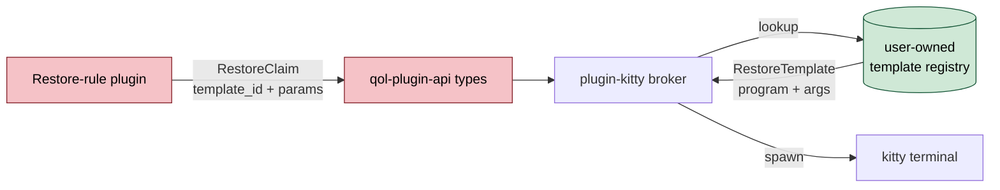
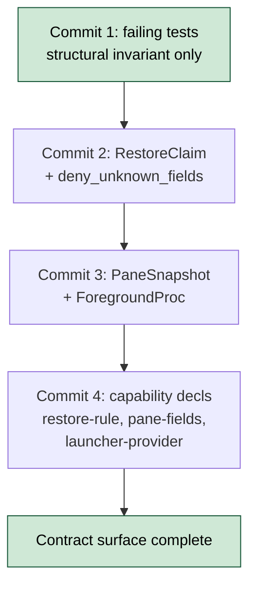

# API-1 Define Restore-Rule Contract Types And Capabilities

- **Status:** Proposed
- **Issue:** #1
- **Date:** 2026-05-12
- **Related:** TRAY-31 (Terminal Workspace Restore epic)

## Problem

`qol-plugin-api` has no contract surface for plugins to participate in a workspace reboot. Without typed structs and capability declarations, every downstream design choice (broker, terminal plugin, session plugin) is unanchored. The contract must encode the structural invariant that **authority over which programs may run after a workspace reboot lives in plugin-kitty's user-owned template registry, never in plugin returns**. The type system itself makes "run arbitrary program at reboot" impossible to express.



| ID | State | Smell |
|----|-------|-------|
| API-1.1 | 🔴 Broken | No `PaneSnapshot` / `RestoreClaim` / `RestoreTemplate` types on qol-plugin-api. No contract surface for plugins to join workspace reboot |
| API-1.2 | 🔴 Broken | No `restore-rule` / `pane-fields` / `launcher-provider` capability declarations. Broker cannot tell which plugins are allowed to claim panes |
| API-1.3 | 🔴 Broken | Contract does not encode "user owns program identity". Without `deny_unknown_fields` and an explicit no-`program`/no-`args` shape, any future field rename could open arbitrary-command execution at reboot |

> Severity: 🔴 bad (broken / silent failure / data loss) · 🟡 warn (leaky / race / brittle) · 🟢 good (used in proposal diagrams to mark what is now safe)

## Proposals

### Proposal A - TDD-first contract with structural-invariant tests `[medium]`

Land the failing-tests-only commit FIRST. Two tests encode the invariant before any type exists:

```rust
#[test]
fn restore_claim_has_no_command_authority() {
    // Authority over what runs lives in plugin-kitty's template registry.
    // RestoreClaim must NEVER carry a program/args field.
    let v = serde_json::to_value(RestoreClaim {
        template_id: "t".into(),
        params: Default::default(),
        env: Default::default(),
    }).unwrap();
    let keys: Vec<&str> = v.as_object().unwrap().keys().map(String::as_str).collect();
    for forbidden in ["program", "args", "argv", "cmd", "command", "exec"] {
        assert!(!keys.contains(&forbidden),
            "RestoreClaim leaked authority via '{forbidden}': {keys:?}");
    }
}

#[test]
fn restore_claim_rejects_command_fields_on_wire() {
    let malicious = r#"{"template_id":"t","params":{},"program":"rm"}"#;
    assert!(serde_json::from_str::<RestoreClaim>(malicious).is_err(),
        "deny_unknown_fields is missing from RestoreClaim");
}
```

The second commit implements just enough to pass them. Subsequent commits add `PaneSnapshot`, `ForegroundProc`, the capability declarations, and the `restore-rule` / `pane-fields` / `launcher-provider` capability schema.



Proposed types from the spec's "Data contracts" section:

```rust
#[derive(Debug, Clone, Serialize, Deserialize)]
#[serde(deny_unknown_fields)]
pub struct PaneSnapshot {
    pub pane_id: String,
    pub cwd: PathBuf,
    pub title: String,
    pub foreground: Vec<ForegroundProc>,
}

#[derive(Debug, Clone, Serialize, Deserialize)]
#[serde(deny_unknown_fields)]
pub struct ForegroundProc {
    pub pid: u32,
    pub exe: String,
    pub argv: Vec<String>,
    pub cwd: PathBuf,
}

#[derive(Debug, Clone, Serialize, Deserialize)]
#[serde(deny_unknown_fields)]
pub struct RestoreClaim {
    pub template_id: String,
    pub params: BTreeMap<String, String>,
    #[serde(default)]
    pub env: Vec<(String, String)>,
}
```

Capability registry additions:

- `restore-rule = true` with required `templates = [...]` and optional `pane-fields = [...]`
- `pane-fields` granularity: `pane-cwd-read`, `pane-argv-read`, `pane-title-read`, `pane-argv-full`
- `launcher-provider = true` (no params)

`RestoreTemplate` stays in plugin-kitty's own config, NOT in qol-plugin-api. Exported here only as a deserialization helper for plugins that read their own suggestion data.

| Pros | Cons |
|------|------|
| Structural-invariant tests make the security model auditable from day one. The type system enforces "user owns program identity" | Slightly more commits than a single mega-PR, but each is reviewable in isolation |
| `deny_unknown_fields` rejects malicious payloads at the wire level, not just at the type level | Granular `pane-fields` capability surface is wider than a single boolean. More for the broker to check |
| Anchors every downstream design choice (broker, terminal plugin, session plugin) on a stable contract | `RestoreTemplate` re-export is a small API surface to maintain on this side even though it lives downstream |

**Closes:** API-1.1, API-1.2, API-1.3

---

**Recommended:** A. The TDD-first ordering is the entire point. Landing the structural-invariant tests before any type exists makes the security model load-bearing on the type system rather than on documentation.

## Notes

- Spec: `workspace/docs/superpowers/specs/2026-05-12-terminal-workspace-restore-design.md`
- Security plan: `workspace/docs/superpowers/plans/2026-05-12-terminal-workspace-restore-security-plan.md`
- Pathways survey: `/tmp/qol-tools-pathways.html` (area `#contract`)
- Epic: [qol-tools/qol-tray#31](https://github.com/qol-tools/issues/31)
