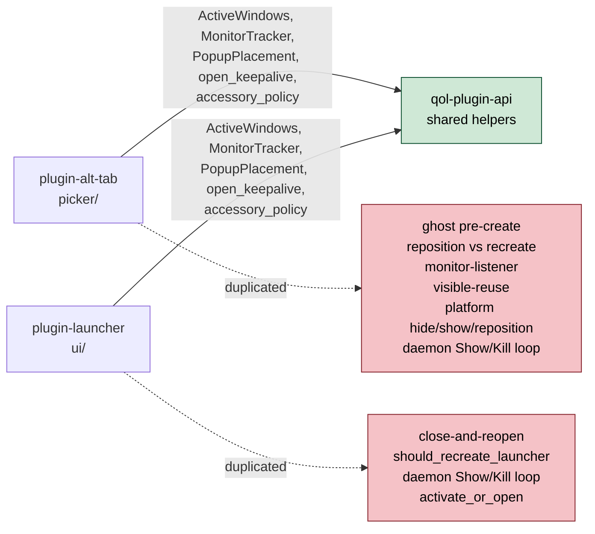
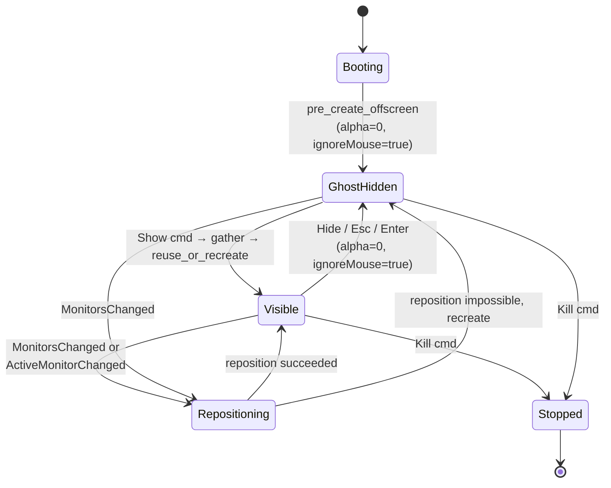
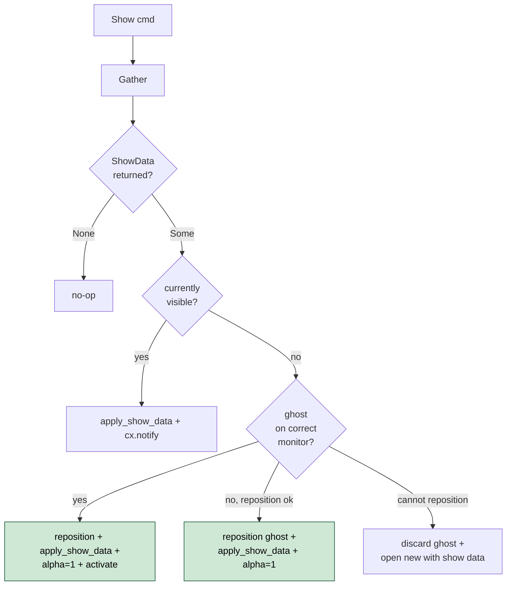

# API-2 Native Popup Host For GPUI Plugins

- **Status:** Proposed
- **Date:** 2026-05-26
- **Related:** Launcher native-popup pivot (back-out of WASM-component plugin migration, 2026-05-18)

## Problem

Two GPUI plugins, `plugin-alt-tab` and `plugin-launcher`, each carry their own native-popup lifecycle: a `daemon` Show/Kill listener, a GPUI `Application::new().run` driver, a keep-alive window, a monitor tracker, a window-reuse decision, and a platform shim layer (hide/show/reposition/activation). The two implementations have diverged in capability rather than in genuine plugin-specific need.



| ID | State | Smell |
|----|-------|-------|
| API-2.1 | 🔴 Broken | `plugin-alt-tab/src/picker/run.rs:130 spawn_daemon_loop` and `plugin-launcher/src/ui/run.rs:76 spawn_command_poll` are structurally identical: `Arc<Mutex<mpsc::Receiver>>` + `cx.spawn` + Show/Kill match. Drifts every time Kill semantics change. |
| API-2.2 | 🔴 Broken | `plugin-launcher` close-and-reopens its `NSWindow` on every Show (`ui/windows.rs:198 should_recreate_launcher`), paying first-paint cost each time. `plugin-alt-tab` keeps a ghost picker at alpha=0 + `ignoresMouseEvents=true` and only repositions it. Asymmetric UX for the same OS-level overlay class. |
| API-2.3 | 🟡 Warn | Platform shims `hide_picker / show_picker / reposition_picker_window / disable_window_shadow / set_ghost_opacity / set_ghost_color` live in `plugin-alt-tab/src/picker/platform/`. Reused only inside one plugin. Launcher has no equivalent, so the ghost pattern cannot be applied there without a copy. |
| API-2.4 | 🟡 Warn | `plugin-alt-tab/src/picker/monitor_listener.rs` wires `MonitorsChanged` / `ActiveMonitorChanged` to reposition the ghost via `reuse::compute_layout`. `plugin-launcher` has `should_recreate_launcher` instead, which fires on Show and recreates the window. Two implementations of the same idea (keep the popup on the active monitor). |
| API-2.5 | 🟡 Warn | The `PICKER_VISIBLE: AtomicBool` flag (alt-tab) and `LauncherView::showing_flag: Arc<AtomicBool>` (launcher) encode the same lifecycle bit (popup is visible vs ghost-hidden) with two different names and two different ownership stories. |

> Severity: 🔴 bad (broken / silent drift) · 🟡 warn (leaky / brittle / asymmetric) · 🟢 good

The lifecycle that has to be expressed identically in both plugins:



Both plugins need this state machine. `plugin-alt-tab` has it (with the ghost step). `plugin-launcher` skips `GhostHidden` and goes `Booting → Visible → Stopped` per Show.

## Proposals

### Proposal A - `PopupHost<View>` in `qol-plugin-api` with `PopupView` trait `[large]`

Promote the lifecycle into `qol-plugin-api`. The plugin provides a `View` type (with ShowData and WarmupSeed associated types), a `gather` closure, a `placement` closure, and a config struct. The host owns the entire state machine plus the platform shims.

```rust
// qol_plugin_api::popup_host

pub trait PopupView: Render + Focusable + Sized + 'static {
    /// Data produced by the gather closure on each Show. Must be Send so the
    /// gather can run on a background executor.
    type ShowData: Send + 'static;

    /// Seed for the offscreen warmup view that lives between Shows. Lets the
    /// plugin pre-render a representative layout so the first real Show paints
    /// at the same size as steady-state (alt-tab uses 7 placeholder cards;
    /// launcher would use an empty result list).
    type WarmupSeed: Send + 'static;

    fn new_warmup(seed: Self::WarmupSeed, window: &mut Window, cx: &mut Context<Self>) -> Self;
    fn apply_show_data(&mut self, data: Self::ShowData, window: &mut Window, cx: &mut Context<Self>);
    fn current_size(&self) -> Size<Pixels>;

    /// Called when the host needs to hide the popup (Esc, Enter, modifier
    /// release, blur). The view decides what cleanup to run; the host then
    /// drops it back to the ghost state.
    fn dismiss(&mut self, window: &mut Window, cx: &mut Context<Self>);
}

pub struct PopupConfig {
    pub window_title: &'static str,
    pub app_id: Option<String>,
    pub transparent_background: bool,
    pub initial_size: Size<Pixels>,
    pub debug: PopupDebugConfig,
}

pub struct PopupDebugConfig {
    pub ghost_alpha: Option<f32>,
    pub ghost_color_hex: Option<String>,
}

pub struct PopupHost<V: PopupView> {
    config: PopupConfig,
    placement_fn: Arc<dyn Fn(&MonitorTracker) -> PopupPlacement + Send + Sync>,
    warmup_fn: Arc<dyn Fn() -> V::WarmupSeed + Send + Sync>,
    gather_fn: Arc<dyn Fn(GatherCtx) -> Pin<Box<dyn Future<Output = Option<V::ShowData>> + Send>> + Send + Sync>,
}

pub struct GatherCtx {
    pub tracker: MonitorTracker,
    pub executor: gpui::BackgroundExecutor,
    pub reverse: bool,
}

impl<V: PopupView> PopupHost<V> {
    pub fn builder(config: PopupConfig) -> PopupHostBuilder<V> { /* ... */ }

    pub fn run(self, rx: mpsc::Receiver<daemon::Command>, show_on_start: bool) {
        // 1. Application::new().run
        // 2. open_keepalive
        // 3. activation::set_accessory_policy
        // 4. MonitorTracker::start
        // 5. spawn monitor_listener (reposition vs recreate using placement_fn)
        // 6. pre_create_offscreen(warmup_fn) → ghost in GhostHidden
        // 7. spawn daemon loop: Show → gather → reuse_or_create; Kill → quit
        // 8. if show_on_start: dispatch Show
    }
}
```

```rust
// daemon::Command stays in qol_plugin_api::daemon

pub enum Command {
    Show { reverse: bool },
    Kill,
}
```

The host's reuse decision:



Platform shims (`hide_popup`, `show_popup`, `reposition_popup`, `disable_window_shadow`, `set_ghost_alpha`, `set_ghost_color`) move from `plugin-alt-tab/src/picker/platform/` into `qol_plugin_api::popup_host::platform` with the same `cfg(target_os = ...)` split.

| Pros | Cons |
|------|------|
| Both plugins consume one state machine. Drift impossible by construction (one daemon loop, one ghost pre-create, one reposition policy). | Generic-over-`View` API is wider than a free function set. New plugin authors have to learn the trait, not just call helpers. |
| Launcher gains ghost-popup UX (no first-paint cost on Show, no NSWindow recreate) by changing one trait impl, not by porting alt-tab's whole platform layer. | Ties `qol-plugin-api` more tightly to GPUI. Already partially the case (`monitor`, `window`, `keepalive` are gpui-feature-gated), but the new module would be the largest gpui-coupled surface yet. |
| Encodes the lifecycle invariants in types: `WarmupSeed` separate from `ShowData` makes "the ghost is not the real popup" load-bearing on the type system. | Async `gather_fn` signature is awkward (boxed future, Send bound) because GPUI's AsyncApp is `!Send`. May need a `LocalGather` variant or a channel-based handoff. See open question 1. |
| Platform shims get one home, one set of tests, one set of cfg-target stubs. | One repo lands the host; both plugins land coordinated bumps. Three-repo coordination, but each is local-squash-merge so no PR overhead. |

**Closes:** API-2.1, API-2.2, API-2.3, API-2.4, API-2.5

### Proposal B - Free helpers in `qol-plugin-api`, no trait `[medium]`

Pull the duplicated pieces out as free functions, each plugin keeps its own `run.rs` and calls them. New module `qol_plugin_api::popup_runtime`:

- `pub fn spawn_daemon_loop<F>(rx, cx, on_show: F, on_kill: F2)` — generic over the Show/Kill callbacks
- `pub fn pre_create_offscreen<V>(view_factory, cx) -> WindowHandle<V>` — opens the offscreen ghost
- `pub fn reuse_or_open<V>(active, target, build_bounds, view_factory, cx)` — the reposition vs recreate decision
- `pub mod platform { fn hide_popup, fn show_popup, fn reposition_popup, ... }`

Each plugin keeps `run.rs` (orchestration) and the platform module wiring; only the duplicated bodies move.

| Pros | Cons |
|------|------|
| Smaller surface area. No trait, no generic-over-`View` types. Easier review. | Lifecycle is not encoded anywhere. Each plugin re-writes the orchestration ("call pre_create, then call spawn_daemon_loop, then..."). Drift returns in 6 months when one plugin adds a new state and the other does not. |
| Each plugin keeps full control of its `run.rs`. Easy to add plugin-specific behavior (alt-tab's `set_ghost_opacity` from config, launcher's blur guard) without negotiating the host API. | API-2.2 (launcher missing ghost) is only partially closed: launcher still has to write its own `run.rs` calling `pre_create_offscreen`. If it forgets, ghost UX silently regresses. |
| Easier rollback. If the host design turns out wrong, pull the helpers back into one plugin. | Doesn't justify a new module. The helpers are useful but the value of "two plugins, one lifecycle" comes from the trait, not from the helpers. |

**Closes:** API-2.1, API-2.3 (partial). Leaves API-2.2, API-2.4, API-2.5 open.

### Proposal C - Status quo `[zero]`

Keep duplication. Launcher never gets ghost UX. Drift continues.

| Pros | Cons |
|------|------|
| Zero work. | Contradicts the project memory direction ("Launchers and switchers are OS-level UX. They must feel like Alfred / Raycast / cmd-tab"). Launcher first-paint cost stays. |

Not viable given stated intent.

---

**Recommended:** A. The lifecycle is the load-bearing thing; the trait encodes it. Proposal B leaves API-2.2 (the actual UX gap) partially open and re-introduces drift. The async-gather awkwardness (open question 1) is real but solvable; the alternative is duplicating the state machine forever.

## Migration plan

Three phases, each in its own worktree, each local-squash-merged to its main clone before the next phase starts.

```mermaid
graph LR
    P1[Phase 1: qol-plugin-api<br/>land popup_host module<br/>+ trait + platform shims<br/>+ unit tests on state machine] --> P2
    P2[Phase 2: plugin-alt-tab<br/>impl PopupView for AltTabApp<br/>replace picker/{run,create,reuse,<br/>monitor_listener,platform}.rs<br/>verify behavior unchanged] --> P3
    P3[Phase 3: plugin-launcher<br/>impl PopupView for LauncherView<br/>replace ui/{run,windows,platform,<br/>keepalive}.rs<br/>ghost UX appears for free]
```

Phase 1 lands by itself. Phase 2 bumps `qol-plugin-api` rev in `plugin-alt-tab/Cargo.toml`. Phase 3 bumps it again in `plugin-launcher/Cargo.toml`.

Lines deleted (estimate, post-port):
- `plugin-alt-tab`: ~1500 lines net (`picker/run.rs` 370, `picker/create.rs` 277, `picker/reuse.rs` 251, `picker/monitor_listener.rs` 289, `picker/platform/*` 645, minus ~300 lines of trait impl + glue).
- `plugin-launcher`: ~700 lines net (`ui/run.rs` 151, `ui/windows.rs` 257, `ui/keepalive.rs` 7, `ui/platform/*` 44, plus equivalents in the upcoming ghost work, minus ~300 lines of trait impl + glue).
- `qol-plugin-api`: +~1200 lines for `popup_host` module + platform shims + tests.

## Open questions

1. **Async gather signature.** GPUI's `AsyncApp` is `!Send`, but plugins want to do background work during gather (alt-tab calls `Platform.visible_windows` on the executor, launcher reads the entries snapshot). Two options: (a) `gather_fn` returns `Pin<Box<dyn Future + Send>>` and the host re-acquires AsyncApp after the future resolves; (b) `gather_fn` runs inside an `AsyncApp` context and the plugin uses `cx.background_spawn` for the Send-bounded portion. Lean toward (b), but the trait-object plumbing is finicky.

2. **Freshness cache.** alt-tab has `DATA_FRESH_TTL = 30s` and skips the heavy `Platform.visible_windows` query within the window. Should the host own a freshness cache, or should the `gather_fn` close over its own? Lean toward "plugin owns its cache, gather_fn closes over it". Keeps the host domain-blind.

3. **Monitor-listener split.** alt-tab's `monitor_listener.rs` does two things: (a) reposition on `MonitorsChanged` / `ActiveMonitorChanged` (generic, host-owned), (b) refresh window list on `WindowListChanged` (domain, plugin-owned). The host should subscribe to (a). The plugin should be free to subscribe to (b) independently. The trait might need a `fn on_subscribe(&self, runtime: &PlatformStateClient)` hook for plugin-specific subscriptions. Or the plugin just spawns its own listener in a closure passed to `PopupHostBuilder`.

4. **Hide-on-blur.** Launcher has `BLUR_GUARD_MS = 400` + `blur_sub` that dismisses on focus loss. alt-tab dismisses on alt-release (modifier-driven, input.rs). Two different policies. Suggest: the View owns the dismiss policy via `cx.observe_window_blur` / input handlers inside its `Render` impl. The host only provides `dismiss()` as the canonical "go back to ghost" transition.

5. **Visible-while-Show.** alt-tab cycles selection when Show fires while already visible. Launcher activates the existing window when Show fires while already visible. Two different "re-Show" semantics. Suggest: `apply_show_data` is called every Show regardless; the View decides what to do with re-entry (alt-tab's cycle_on_open behavior moves into View; launcher's re-focus moves into View). Host stays policy-free.

6. **Configuration shape.** `PopupConfig` carries `window_title`, `app_id`, `transparent_background`, `initial_size`, ghost debug fields. Open: should it also carry `WindowKind` (PopUp vs Normal) and `window_decorations` (Server vs Client)? Probably yes — alt-tab and launcher both want PopUp + Client. Keep these in `PopupConfig` so the host can pick reasonable defaults without leaking GPUI types through the trait.

## Notes

- Surveyed code:
  - `plugin-alt-tab/src/picker/{mod,run,create,reuse,monitor_listener}.rs`
  - `plugin-alt-tab/src/picker/platform/{mod,macos,linux}.rs`
  - `plugin-alt-tab/src/app/mod.rs` (View shape)
  - `plugin-launcher/src/ui/{mod,run,windows,keepalive,platform}.rs`
  - `plugin-launcher/src/ui/view.rs` (View shape)
  - `qol-plugin-api/src/{lib,window,monitor,keepalive,activation}.rs`
- Project context: `MEMORY.md::launcher-native-popup-pivot` (back-out of WASM-component plugin migration, 2026-05-18).
- This ADR proposes the contract only. Implementation lands in a follow-up worktree per phase.
