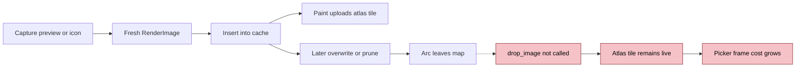
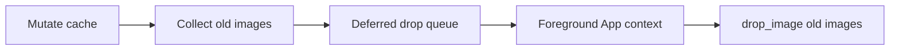
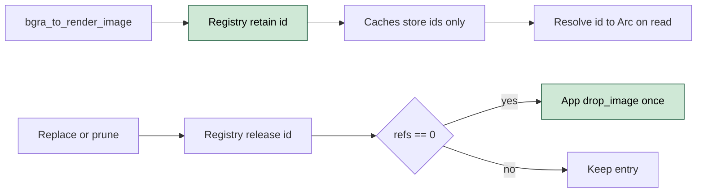
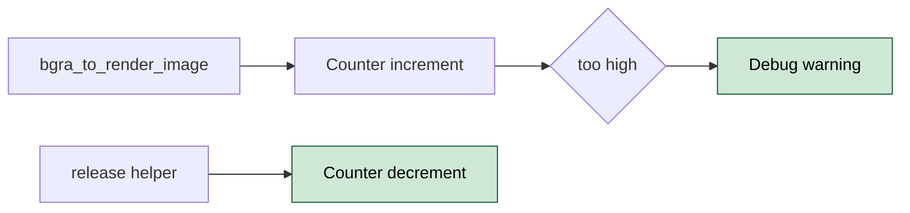

# ALTTAB-2 GPU Atlas Tile Leak Causes Picker FPS To Degrade After Extended Use

- **Status:** Proposed
- **Issue:** #2
- **Date:** 2026-05-04
- **Related:** Separate upstream GPUI atlas cleanup bug; separate ScreenCaptureKit migration

## Problem

plugin-alt-tab creates fresh `Arc<RenderImage>` values for live preview and icon images, then overwrites or prunes maps without calling `App::drop_image`. GPUI keeps atlas entries alive until `drop_image` reaches the platform atlas, so repeated picker use silently accumulates GPU atlas tiles and degrades picker rendering over long sessions.

The leak is permanent on macOS because `pre_create_offscreen` (`src/picker/create.rs:183`) opens the picker window once at daemon boot, registers it under `BOOTSTRAP_KEY`, and reuses the same handle for every alt-tab. Linux destroys and recreates the window on monitor reconfig (`src/picker/platform/linux.rs:219`, `:227`), so the atlas dies with the window and the leak resets per cycle. Scope of the bug is the macOS keep-alive path.

`MetalAtlas::remove` (`gpui-0.2.2/src/platform/mac/metal_atlas.rs:60-86`) leaves `tiles_by_key` populated when the texture is still referenced and puts the texture back via `*texture_slot = Some(texture)`. A second `drop_image` for the same `RenderImage` re-enters the same branch and double-decrements `ref_count`. Any fix MUST guarantee each `RenderImage` id is dropped exactly once.

| ID | State | Smell |
|----|-------|-------|
| ALTTAB-2.1 | Broken | Preview replacement and pruning paths drop old `RenderImage` Arcs without calling `App::drop_image`. |
| ALTTAB-2.2 | Broken | Icon-cache replacement and pruning paths have the same atlas-lifetime bug and should be fixed in the same PR. |
| ALTTAB-2.3 | Leaky | Background merge helpers mutate shared caches without `&mut App`, so they cannot release replaced atlas images today. |
| ALTTAB-2.4 | Leaky | There is no plugin-side outstanding-image counter, making this class of regression silent. |
| ALTTAB-2.5 | Separate | GPUI atlas `tiles_by_key` cleanup and `CGWindowListCreateImage` migration are independent follow-up work. |
| ALTTAB-2.6 | Hazard | `MetalAtlas::remove` semantics make scattered or duplicate `drop_image` calls unsafe; atlas refcount can be decremented twice for the same id. Forces single-owner drop. |

> Severity: Broken means a confirmed user-visible leak path. Leaky means missing ownership or observability around the leak. Separate means confirmed but intentionally out of scope. Hazard means a correctness constraint the fix must satisfy.

## Proposals

### Proposal A - Deferred Drop Queue `[medium]`

Keep the existing pure map-mutating helpers. Return dropped `Arc<RenderImage>` values to foreground callers, then drain them later from an `App` context with `drop_image(arc, None)`.

| Pros | Cons |
|------|------|
| Minimizes signature churn at individual map helpers. | Adds temporary ownership state that is easy to forget to drain. |
| Works for background mutation sites. | Keeps the background cache mutation shape that caused the plumbing problem. |

Verdict: rejected. With a deferred queue, the same `Arc` can be queued by multiple owners (e.g. PickerState replacement plus SharedCache prune) and `drop_image` runs once per queue entry, which is the double-decrement that ALTTAB-2.6 forbids on macOS.

**Closes:** ALTTAB-2.1, ALTTAB-2.3 (rejected, kept for context only)

---

### Proposal B - Centralized Image Registry With Single-Owner Drop `[medium]`

Introduce one `ImageRegistry` that owns every `Arc<RenderImage>` allocated by the picker. All caches (`PickerState`, `SharedPreviewCache`, `SharedIconCache`) hold `RenderImageId` references through the registry instead of `Arc<RenderImage>` directly. Inserts call `registry.retain(id)`; replacements and prunes call `registry.release(id)`; the registry calls `App::drop_image` exactly once per id when its refcount reaches zero.

This is a hard requirement, not a stylistic preference: `MetalAtlas::remove` double-decrements its texture refcount when called twice for the same key (ALTTAB-2.6), so scattered `drop_image` calls at every owner site are unsafe. One owner, one drop, deterministic. Foreground vs background distinction collapses: background paths produce ids and register; only the registry calls `drop_image`, foreground-only.

| Pros | Cons |
|------|------|
| Each id is dropped exactly once across all owners; immune to MetalAtlas double-decrement (ALTTAB-2.6). | Caches now hold ids, not Arcs; read paths resolve through the registry. |
| Single audit surface for atlas lifetime; future regressions touch one type. | Larger refactor than touching individual mutation sites. |
| Async paths produce ids and register without needing `&mut App`; only release is foreground. | Registry must run inside `&mut App` for `drop_image`, so `release` is foreground-only. |

**Closes:** ALTTAB-2.1, ALTTAB-2.2, ALTTAB-2.3, ALTTAB-2.6

---

### Proposal C - Outstanding Render Image Counter `[cheap]`

Increment a plugin-side `OUTSTANDING_RENDER_IMAGES` counter when `bgra_to_render_image` allocates, and decrement only through the release helper after `App::drop_image`. Add a debug warning threshold so future unpaired allocations are visible.

| Pros | Cons |
|------|------|
| Cheap permanent regression signal for this leak class. | It is a proxy, not a direct GPU atlas metric. |
| Fits naturally into the same helper that releases images. | Needs careful accounting for cloned Arcs stored in multiple maps. |

**Closes:** ALTTAB-2.4

---

**Recommended:** Ship Proposal B plus Proposal C. Single-owner `drop_image` via the registry is the hard correctness requirement (ALTTAB-2.6); Proposal A's deferred queue is unsafe under `MetalAtlas` refcount semantics and must not be combined with B. File the GPUI atlas cleanup issue and `CGWindowListCreateImage` migration separately.

## Notes

Eleven semantic mutation sites at merged HEAD where an `Arc<RenderImage>` is dropped without `App::drop_image`. The implementation must route every one through the centralized registry (Proposal B); none should call `App::drop_image` directly.

Foreground (PickerState; already inside `cx.update`):

- `src/app/mod.rs:173`: `state.live_previews = gathered.previews.clone();` (whole map replace)
- `src/app/mod.rs:176`: `state.icon_cache = gathered.icons.clone();` (whole map replace)
- `src/app/live_preview.rs:127`: `state.live_previews.insert(wid, img);`
- `src/picker/mod.rs:283`: `self.live_previews.retain(|id, _| active_ids.contains(id));`
- `src/picker/mod.rs:301`: `self.icon_cache.extend(icons);`
- `src/picker/mod.rs:305`: `self.live_previews.extend(previews);`

Background (SharedCache; AsyncApp / BackgroundExecutor):

- `src/picker/run.rs:220`: `cache.retain(...)` for previews (called inside `cx.update` via `apply_show_windows`)
- `src/picker/run.rs:228`: `cache.retain(...)` for icons (called inside `cx.update` via `apply_show_windows`)
- `src/picker/run.rs:272`: `cache.insert(name, img);` (`merge_icons`, async path)
- `src/picker/gather.rs:106`: `icache.insert(k.clone(), v.clone());` (`merge_into_shared_cache`, async path)
- `src/picker/gather.rs:242`: `pcache.insert(*k, v.clone());` (`merge_into_shared_preview_cache`, async path)

Ground truth references:

- `App::drop_image` at `gpui-0.2.2/src/app.rs:2071` (forwards to `Window::drop_image`)
- `Window::drop_image` at `gpui-0.2.2/src/window.rs:3198` (calls `sprite_atlas.remove`)
- `MetalAtlas::remove` at `gpui-0.2.2/src/platform/mac/metal_atlas.rs:60` (`tiles_by_key.get` not `.remove`; texture put back when refcount > 0; double-decrement hazard)
- `BladeAtlas::remove` at `gpui-0.2.2/src/platform/blade/blade_atlas.rs:104` (`tiles_by_key.remove` unconditional; safe under repeat call)
- `grep drop_image plugin-alt-tab/src` returns zero matches.
