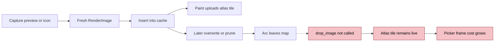
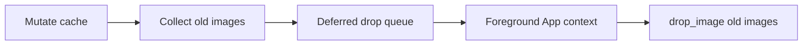
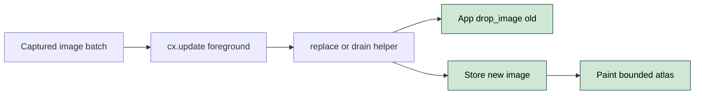
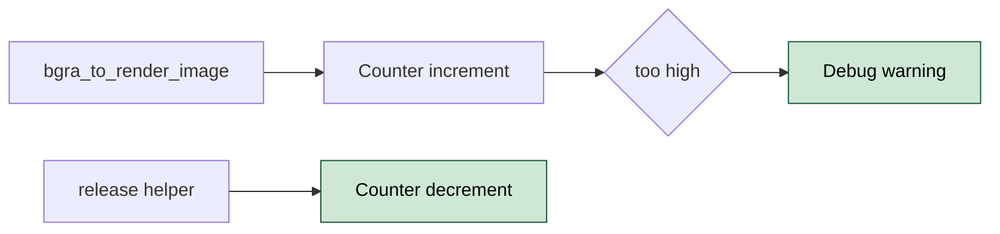

# ALTTAB-2 GPU Atlas Tile Leak Causes Picker FPS To Degrade After Extended Use

- **Status:** Proposed
- **Issue:** #2
- **Date:** 2026-05-04
- **Related:** Separate upstream GPUI atlas cleanup bug; separate ScreenCaptureKit migration

## Problem

plugin-alt-tab creates fresh `Arc<RenderImage>` values for live preview and icon images, then overwrites or prunes maps without calling `App::drop_image`. GPUI keeps atlas entries alive until `drop_image` reaches the platform atlas, so repeated picker use silently accumulates GPU atlas tiles and degrades picker rendering over long sessions.

| ID | State | Smell |
|----|-------|-------|
| ALTTAB-2.1 | Broken | Preview replacement and pruning paths drop old `RenderImage` Arcs without calling `App::drop_image`. |
| ALTTAB-2.2 | Broken | Icon-cache replacement and pruning paths have the same atlas-lifetime bug and should be fixed in the same PR. |
| ALTTAB-2.3 | Leaky | Background merge helpers mutate shared caches without `&mut App`, so they cannot release replaced atlas images today. |
| ALTTAB-2.4 | Leaky | There is no plugin-side outstanding-image counter, making this class of regression silent. |
| ALTTAB-2.5 | Separate | GPUI atlas `tiles_by_key` cleanup and `CGWindowListCreateImage` migration are independent follow-up work. |

> Severity: Broken means a confirmed user-visible leak path. Leaky means missing ownership or observability around the leak. Separate means confirmed but intentionally out of scope.

## Proposals

### Proposal A - Deferred Drop Queue `[medium]`

Keep the existing pure map-mutating helpers. Return dropped `Arc<RenderImage>` values to foreground callers, then drain them later from an `App` context with `drop_image(arc, None)`.

| Pros | Cons |
|------|------|
| Minimizes signature churn at individual map helpers. | Adds temporary ownership state that is easy to forget to drain. |
| Works for background mutation sites. | Keeps the background cache mutation shape that caused the plumbing problem. |

**Closes:** ALTTAB-2.1, ALTTAB-2.3

---

### Proposal B - Re-Plumb Cache Mutation Through App Context `[medium]`

Move cache replacement and pruning to foreground `cx.update` blocks that already have `&mut App`. Add shared replacement and drain helpers that call `App::drop_image` before removing old images, and wire all 11 confirmed preview and icon sites through them.

| Pros | Cons |
|------|------|
| Makes image lifetime explicit at every cache mutation site. | Requires signature changes across foreground picker and app paths. |
| Deletes background merge helpers instead of adding deferred bookkeeping. | Slightly larger diff than the original issue sketch. |
| Covers preview and icon caches in one coherent ownership rule. | Must handle `Option<&mut Window>` correctly when calling `drop_image`. |

**Closes:** ALTTAB-2.1, ALTTAB-2.2, ALTTAB-2.3

---

### Proposal C - Outstanding Render Image Counter `[cheap]`

Increment a plugin-side `OUTSTANDING_RENDER_IMAGES` counter when `bgra_to_render_image` allocates, and decrement only through the release helper after `App::drop_image`. Add a debug warning threshold so future unpaired allocations are visible.

| Pros | Cons |
|------|------|
| Cheap permanent regression signal for this leak class. | It is a proxy, not a direct GPU atlas metric. |
| Fits naturally into the same helper that releases images. | Needs careful accounting for cloned Arcs stored in multiple maps. |

**Closes:** ALTTAB-2.4

---

**Recommended:** Ship Proposal B plus Proposal C, and include icon-cache wiring in the same PR. File the GPUI atlas cleanup issue and ScreenCaptureKit migration separately.

## Notes

The final issue comment verified 11 leak sites: `src/app/live_preview.rs:127`, `src/app/mod.rs:168`, `src/picker/mod.rs:298`, `src/picker/mod.rs:276`, `src/picker/gather.rs:243`, `src/picker/run.rs:191`, `src/app/mod.rs:171`, `src/picker/mod.rs:294`, `src/picker/run.rs:243`, `src/picker/gather.rs:106`, and `src/picker/run.rs:199`. `App::drop_image` was confirmed at `gpui-0.2.2/src/app.rs:2071`, and `grep drop_image plugin-alt-tab/src` returned zero matches before this work.
