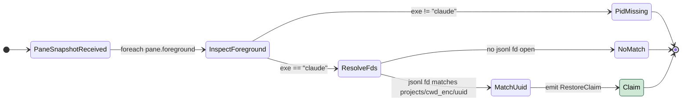
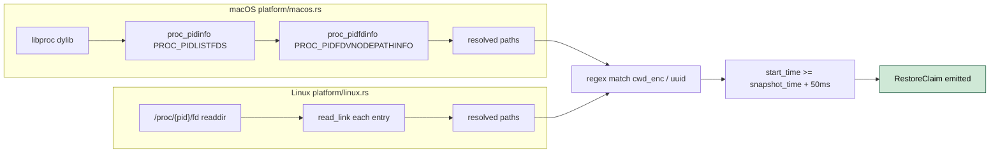

# CSESS-1 Build plugin-claude-sessions libproc fd resolver

- **Status:** Proposed
- **Issue:** qol-tools/plugin-claude-sessions#1
- **Date:** 2026-05-12
- **Related:** API-1 (qol-tools/qol-plugin-api#2), TRAY-31 (qol-tools/qol-tray#31)

## Problem

`plugin-claude-sessions` is one of three parallel-after-contract sub-issues in the terminal-workspace-restore epic (qol-tray#31). The contract it consumes - `PaneSnapshot`, `RestoreClaim`, `RestoreRuleCapability` - lives on `qol-plugin-api` PR #2 (draft, mergeable=clean) and is locked in. This sub-issue carries the plugin itself: a binary that, given a `PaneSnapshot` from any terminal plugin, looks up each `claude` process by PID, walks its open file descriptors to find the active `~/.claude/projects/<encoded-cwd>/<uuid>.jsonl`, and emits one `RestoreClaim { template_id: "claude-session", params: { uuid, cwd_enc } }` per match.

The plugin must not know which terminal hosts the process; that is the terminal plugin's concern. It must not declare argv; that lives in plugin-kitty's template registry as `claude --resume {uuid}`. It only resolves PID-to-uuid and emits a strongly typed claim.

| ID | State | Smell |
|----|-------|-------|
| CSESS-1.1 | 🔴 Broken | macOS PID-to-uuid resolution does not yet exist: no libproc binding in this plugin, so the entire restore path returns empty claims on darwin. |
| CSESS-1.2 | 🔴 Broken | Linux PID-to-uuid resolution does not yet exist: no `/proc/<pid>/fd` walker, so the restore path returns empty claims on linux. |
| CSESS-1.3 | 🟡 Leaky | PID-reuse races are not yet gated: if a fresh process inherits a PID between snapshot capture and resolution, the plugin could claim against the wrong process. Mitigated by requiring `start_time >= snapshot_time + 50ms`. |
| CSESS-1.4 | 🟡 Leaky | The set of accepted `claude` binaries is unbounded. A spoofer with `argv[0] == "claude"` could trigger a claim. Mitigated by realpath check against a pinned binary plus a defensive install-location regex. |
| CSESS-1.5 | 🟡 Leaky | The plugin manifest must declare the `claude-session` template suggestion; without it, plugin-kitty has nothing to surface at install time and the bridge has no entry point. |

> Severity: 🔴 bad (broken / silent failure / data loss) - 🟡 warn (leaky / race / brittle) - 🟢 good (used in proposal diagrams to mark what is now safe)

## Proposals

### Proposal A - libproc on macOS, /proc/<pid>/fd on Linux, defer Windows `[medium]`

Build the resolver as a strategy-pattern module (`src/resolver/platform/macos.rs`, `src/resolver/platform/linux.rs`, common trait in `src/resolver/mod.rs`). macOS uses the libproc dylib already linked into qol-tray (no new system dependency). Linux uses `std::fs::read_dir("/proc/<pid>/fd")` followed by `read_link` on each entry. Windows is deferred per the design spec's non-goals.

The match rule (per the design spec) requires ALL of:

1. `pane.foreground[0].exe == "claude"`.
2. argv[0] realpaths to either the pinned `claude` path from `~/.config/qol-tray/plugin-claude-sessions.toml` OR matches `^.*/(\.claude/local/|node_modules/@anthropic-ai/claude-code/)claude$`.
3. At least one open fd realpath matches `^<expanded-$HOME>/\.claude/projects/(?P<cwd_enc>[A-Za-z0-9._-]+)/(?P<uuid>[0-9a-f-]{36})\.jsonl$`.
4. Process start time at least 50 ms older than the snapshot request (PID-reuse defense).

The manifest declares the suggested template verbatim from the design spec, so plugin-kitty can offer it at install time.

| Pros | Cons |
|------|------|
| Reuses libproc already linked into qol-tray; no new system dependency on macOS. | Linux `/proc/<pid>/fd` walk is O(open_fds) per claude process; acceptable for tens of panes, would not scale to hundreds. |
| Strategy-pattern compartmentalization keeps cross-platform code from leaking into shared modules (per `qol-arch-cross-platform`). | Requires careful `[target.'cfg(target_os = ...)'.dependencies]` wiring in Cargo.toml to keep dead_code lints quiet on the other OS. |
| Match rule is the same on both platforms; only the fd-enumeration mechanism varies. | PID-reuse window (~50ms) is heuristic, not perfectly safe. |
| Manifest-declared template suggestion keeps plugin-kitty as the sole owner of argv shape. | First-time install adds a "approve template" prompt; users who skip it silently break the feature. |

**Closes:** CSESS-1.1, CSESS-1.2, CSESS-1.3, CSESS-1.4, CSESS-1.5

---

**Recommended:** A (only proposal; the contract is locked, the platform split is forced by what each OS exposes).

## Notes

- Contract source of truth: `qol-tools/qol-plugin-api` PR #2 (`PaneSnapshot`, `ForegroundProc`, `RestoreClaim`, `RestoreRuleCapability`).
- Full design: `workspace/docs/superpowers/specs/2026-05-12-terminal-workspace-restore-design.md`, section "plugin-claude-sessions design" (lines 354-423).
- Sibling sub-issues in TRAY-31 epic: plugin-kitty (template registry + reboot orchestrator), qol-tray (snapshot supervision + workspace lifecycle).
- Security analysis: same spec, section "Security analysis" (lines 457-650). Notable bounds:
  - Worst-case spoof: forces `claude-session` template to launch with attacker-controlled `uuid`, but `pre_check` requires the file to exist and the regex bounds the value to 36 hex/dash chars.
  - `.jsonl` content never leaves the plugin; only the uuid (a 36-char identifier) flows over the cross-plugin IPC.
- Cross-platform strategy pattern: see `qol-arch-code` for the compartmentalization rules; see `qol-arch-cross-platform` for the dead_code / unused_import traps under `-D warnings`.
