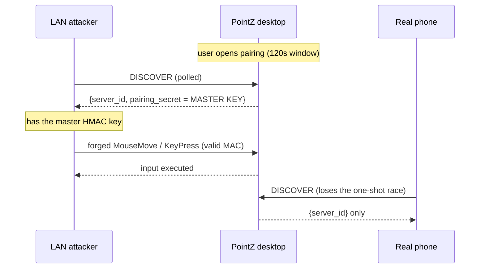

# POINTZ-1 Pairing Secret Is Broadcast In Plaintext During Discovery

- **Status:** Proposed
- **Issue:** none (security finding F1, reproduced in a `linux/mint-cinnamon` guest on 2026-08-05)
- **Date:** 2026-08-05
- **Related:** F2 wheel-storm and F3 cursor-poison input bounds (fixed separately, same review); pointz-client Flutter repo (companion change required)

## Problem

PointZ authenticates every command with one long-term HMAC-SHA256 key, and it hands that key to a new device by broadcasting it in cleartext.

When the user opens pairing, `CommandGate::begin_pairing` (`src/security/mod.rs:46`) arms a 120-second window.
While the window is open, `DiscoveryService::send_response` (`src/discovery/mod.rs:27`) answers any `DISCOVER` datagram with a JSON body that includes `pairing_secret`, and that field is the full base64url of the 32-byte master secret (`CommandGate::discovery_auth`, `src/security/mod.rs:53`; `PairingSecret::encoded`, `src/security/secret.rs:61`).
The datagram is plain UDP on `0.0.0.0:45454`, so a LAN attacker who polls `DISCOVER` wins the one-shot race, and a passive attacker who captures the packet needs no race at all.

Once an attacker holds the secret, they hold the only key the command channel checks.
`CommandGate::authenticate` (`src/security/mod.rs:65`) verifies the packet MAC against that same shared secret, so a captured secret forges every command for every session until the user manually rotates it, and there is no per-device identity to revoke.

The reproduction captured the secret during the window and then drove authenticated input from a second peer, confirming both the plaintext handoff and the unlimited forgery that follows.



| ID | State | Smell |
|----|-------|-------|
| POINTZ-1.1 | Broken | Discovery emits the full master HMAC key as plaintext UDP JSON during the pairing window. A passive sniffer reads it with no race. |
| POINTZ-1.2 | Broken | Every device shares one master key, so a single capture forges all commands forever with no revocation path. |
| POINTZ-1.3 | Hazard | Any fix that makes a low-entropy typed PIN the confidentiality mechanism is offline-brute-forceable, so the PIN may authenticate but must not be the thing that hides the key. |
| POINTZ-1.4 | Separate | The 30-second clock-skew and replay window (`src/security/mod.rs:67`) and the F2/F3 input bounds are out of scope here. |
| POINTZ-1.5 | Leaky | There is no device registry, so pairings cannot be listed, named, or individually revoked, and a leak has no containment or audit. |

> Severity: Broken means a confirmed exploitable path. Hazard means a correctness constraint the fix must satisfy. Separate means confirmed but intentionally out of scope. Leaky means missing containment or observability around the weakness.

## Goals

Close the handoff so no key material readable by a network observer ever crosses the wire.
Replace the shared master key with a per-device key, so the master identity never leaves the desktop and one device's compromise stays contained.
Keep the user experience the chosen one: the desktop shows a short code, the user types it on the phone.

## Constraints that shape the design

The typed code is low entropy (a 6-digit PIN is about 20 bits).
POINTZ-1.3 is the load-bearing constraint: if the key handoff is encrypted under a key derived only from the PIN, an attacker who captured the ciphertext tries all million PINs offline and recovers the key, so the plaintext hole is merely reshaped, not closed.
Confidentiality therefore has to come from an ephemeral Diffie-Hellman exchange whose secret an observer cannot compute, and the PIN's job is narrowed to authenticating that exchange against an active man-in-the-middle.

## Proposals

### Proposal A - X25519 handoff, PIN-authenticated, per-device key `[large, recommended]`

Confidentiality comes from an ephemeral X25519 exchange; the PIN only authenticates it; the desktop then seals a fresh per-device key to the phone.

The desktop keeps a server identity seed (the file today called `pairing-secret`, re-scoped to derive `server_id` only and never transmitted) plus a device registry mapping `device_id` to a 32-byte `K_dev`.
Opening pairing generates a PIN, displays it, generates an ephemeral X25519 keypair, and opens a 60-second window that closes after three failed attempts.

```mermaid
sequenceDiagram
    participant C as Phone
    participant D as Desktop (shows PIN)
    C->>D: PairHello { device_id, client_pub Qc, name }
    D-->>C: PairOffer { server_id, server_pub Qd, salt }
    Note over C,D: Z = X25519(own_priv, peer_pub)
    Note over C,D: PRK = HKDF-Extract(salt, Z)
    Note over C,D: K_auth, K_wrap = HKDF-Expand(PRK, label ‖ ids ‖ Qc ‖ Qd ‖ PIN)
    C->>D: PairConfirm { device_id, client_confirm = HMAC(K_auth,"client") }
    Note over D: wrong PIN or MITM => confirm fails => attempt++; 3 strikes closes window
    D-->>C: PairResult { server_confirm = HMAC(K_auth,"server"),<br/>sealed = AEAD(K_wrap, K_dev, aad = device_id ‖ server_id) }
    Note over D: store device_id -> K_dev, wipe PIN + ephemerals
    Note over C: check server_confirm, decrypt sealed -> K_dev, store
```

The PIN is folded into the HKDF-Expand info, so `K_auth` and `K_wrap` depend on both the DH secret `Z` and the PIN.
A passive sniffer sees only the two public keys and two ciphertext-like blobs; lacking either private key it cannot compute `Z`, cannot derive `K_wrap`, and the sealed key stays opaque, and the PIN never appears on the wire.
An active man-in-the-middle can run its own DH with each side but cannot fold in the PIN it does not know, so its confirmation MAC is wrong and the window closes after three online guesses; there is no offline guess because testing a PIN still needs `Z`.

The command channel moves to envelope v2, which adds `device_id` and keys the MAC by `K_dev`:
`mac = HMAC-SHA256(K_dev, [2] ‖ sent_at_ms_be ‖ device_id ‖ nonce ‖ payload)`.
`authenticate` resolves `device_id` to its `K_dev` in the registry, rejects unknown devices, then applies the existing clock-skew and per-device replay checks.
Discovery drops `pairing_secret` entirely and advertises only `{ hostname, server_id, authentication: "pair-x25519-v1", pairing_open: bool }`, so the field that leaked the key no longer exists.

| Pros | Cons |
|------|------|
| Closes both the passive-sniff and the online-race paths; satisfies POINTZ-1.3 because confidentiality rests on DH, not on PIN entropy. | Largest change: a new pairing state machine plus three vetted crypto dependencies. |
| Per-device keys give listing, naming, and one-tap revocation; the master identity never leaves the desktop. | Breaking protocol change; desktop and client must ship together (see Rollout). |
| Ephemeral keys per pairing give forward secrecy for the handoff. | New UI to surface the PIN and the paired-device list. |

Verdict: recommended.
It is the only proposal that keeps the typed-PIN experience the user chose while still satisfying POINTZ-1.3.

### Proposal B - PIN-derived wrap key, per-device key `[medium]`

The literal reading of "derive a transport key from the PIN": the desktop seals `K_dev` under `AEAD(HKDF(PIN, salt=server_id), K_dev)` and sends it during discovery, the phone derives the same key from the typed PIN and decrypts.

| Pros | Cons |
|------|------|
| Small change; no DH, no new asymmetric dependency. | Violates POINTZ-1.3: the sealed blob is offline-brute-forceable, about a million PIN guesses recover `K_dev` from one captured packet. |
| Keeps the typed-PIN experience. | Reshapes the plaintext hole into a brute-force hole rather than closing it. |

Verdict: rejected.
It looks like a fix but leaves a passive attacker one cheap offline search away from the key, which is the exact failure class POINTZ-1.3 forbids.

### Proposal C - QR high-entropy transfer, per-device key `[medium]`

Instead of a typed PIN, the desktop shows a QR code carrying a single-use 256-bit transfer key; the phone scans it and the desktop seals `K_dev` under that key.

| Pros | Cons |
|------|------|
| Simplest crypto that is still safe: a 256-bit code is not brute-forceable, so a plain AEAD wrap suffices with no DH. | Changes the experience from typing to scanning, which needs camera permission and rejects the code the user picked. |
| Screen-to-camera is an out-of-band channel a network attacker never sees. | Harder when the phone is the screen you are pairing from, or when no camera is available. |

Verdict: alternative.
Choose this only if scanning is acceptable; it is cryptographically simpler than Proposal A but abandons the typed-PIN decision.

### Proposal D - SPAKE2 (PAKE) `[large]`

Use a password-authenticated key exchange with the PIN as the password, yielding a strong session key with no offline guessing by construction.

| Pros | Cons |
|------|------|
| The textbook primitive for exactly this problem; strongest guarantees. | Needs a vetted SPAKE2 on both Rust and Dart; the Dart side is the risk. |
| No hand-rolled transcript binding. | Heavier than Proposal A for the same practical outcome given our threat model. |

Verdict: alternative.
Equivalent security to Proposal A in practice; hold in reserve if a maintained Dart SPAKE2 is preferred over the explicit X25519 construction.

## Rollout across the two repos

This is a hard cutover, because the command MAC and the discovery contract both change shape.
Because one author controls both the desktop plugin and the Flutter client and the whole fleet, a lockstep release is realistic and simpler than a dual-stack transition.

Desktop (this repo, `plugins/pointz`):
- Re-scope `PairingSecret` to a server identity seed used only for `server_id`; add a persisted `DeviceRegistry` (`plugins/plugin-pointz/devices.json`, written with `qol_fs::atomic_write_private`) with add, lookup, remove, and list.
- Add `src/security/pairing.rs` for the X25519 + HKDF + HMAC + AEAD state machine, PIN generation, and the three-attempt limiter.
- Move `src/security/wire.rs` to envelope v2 with `device_id`; delete v1 verification (no dual stack).
- Update `CommandGate` to resolve `K_dev` by `device_id` and to own the active pairing session; update `begin_pairing` to produce and surface the PIN.
- Drop `pairing_secret` from `DiscoveryResponse` and add `pairing_open` (`src/discovery/model.rs`, `src/discovery/mod.rs`).
- Route the pairing messages on the command socket; surface the PIN and a paired-device list with unpair in the settings UI; extend `doctor` to report device count and pairing state without ever printing key bytes.
- Dependencies to add: `x25519-dalek`, `hkdf`, and one AEAD (`chacha20poly1305` or `aes-gcm`); clear them against the dependency-audit and cross-platform norms first.

Client (pointz-client, Flutter):
- Add the `cryptography` package for X25519, HKDF, HMAC-SHA256, and AEAD.
- Build the pairing screen that takes the typed PIN and runs PairHello through PairResult; store `{ server_id, device_id, K_dev }` in `flutter_secure_storage`.
- Send v2 command envelopes keyed by `K_dev` with `device_id`; parse `pairing_open` and stop reading `pairing_secret`.
- On upgrade, discard any stored master secret and force a re-pair.

Sequencing:
- Land the desktop and client changes behind their version bumps, then release together.
- A stale client meeting a new desktop sees `authentication: "pair-x25519-v1"` and prompts to update; a new client meeting a stale desktop refuses the plaintext secret and prompts to update the desktop.

## Testing

Desktop unit tests: happy-path pairing; wrong PIN rejected and the window closing after three attempts; a man-in-the-middle with its own public key and no PIN failing confirmation; `sealed` decrypting only under the correct `K_wrap`; unknown `device_id` rejected; per-device replay; `server_confirm` authenticating the desktop to the client.
A shared cross-implementation vector (in the spirit of the existing `flutter_protocol_fixture_verifies` in `src/security/wire.rs`) that both repos verify against a fixed transcript.
Guest-VM end-to-end: script a client through a full pairing, drive an authenticated command with the resulting `K_dev`, and `tcpdump` the loopback during pairing to assert the PIN bytes and `K_dev` bytes never appear on the wire.
Negative end-to-end: a captured pairing transcript cannot forge a later command.

## Consequences

The plaintext-secret discovery path is deleted, so POINTZ-1.1 is gone at the root.
Per-device keys give containment and revocation, addressing POINTZ-1.2 and POINTZ-1.5.
The cost is one coordinated release across two repos and a small, vetted crypto surface on each side.
The user experience stays the typed-code flow that was chosen; the only visible additions are the code display and a paired-device list.
